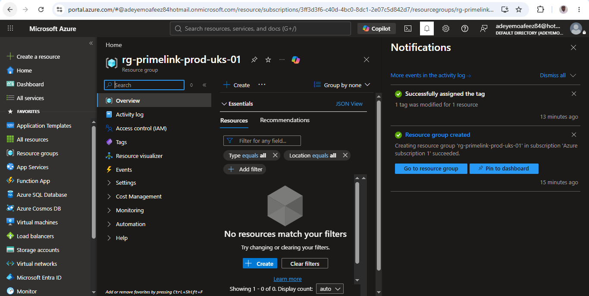
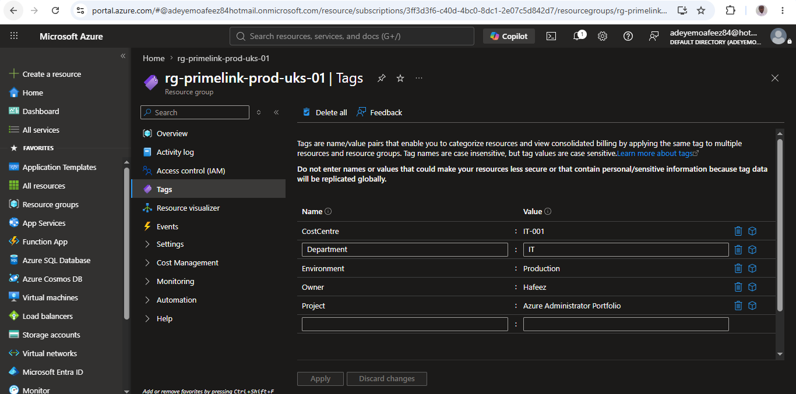
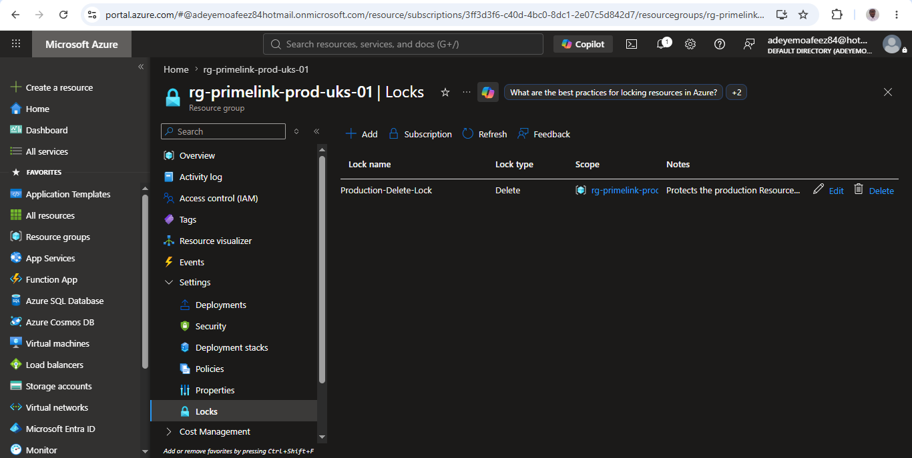
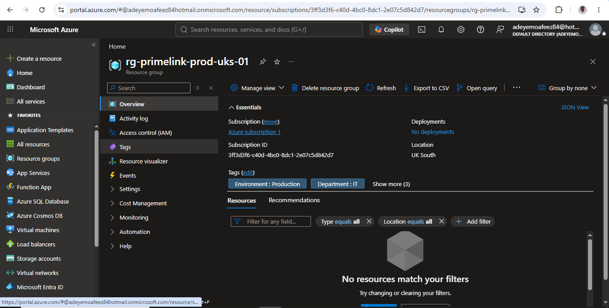

# Enterprise Azure Resource Group Governance Foundation

| Property | Value |
|----------|-------|
| Project Number | 01 |
| Module | Governance |
| Difficulty | Beginner |
| Estimated Completion Time | 30 Minutes |
| Azure Services Used | 4 |
| Deployment Method | Azure Portal |
| Status | ✅ Completed | 

## Business Scenario

PrimeLink Solutions Ltd. is a growing technology company that is migrating its on-premises infrastructure to Microsoft Azure.

As part of the cloud adoption initiative, the Azure Administrator has been assigned to establish a governance foundation that ensures Azure resources are consistently organized, protected against accidental deletion, and prepared for future expansion.

The organization requires a standardized naming convention, resource tagging strategy, and governance controls that will support future deployments of virtual machines, storage accounts, networking resources, and monitoring services.

## Business Requirements

The organization requires the Azure environment to:

- Organize cloud resources using a standardized Resource Group structure.
- Apply a consistent naming convention across Azure resources.
- Implement resource tags to improve cost management and governance.
- Protect production resources from accidental deletion.
- Establish a scalable governance foundation for future Azure deployments.

## Azure Services and Features Used

- Azure Resource Groups
- Azure Resource Manager (ARM)
- Azure Resource Tags
- Azure Resource Locks

## Tools Used

- Microsoft Azure Portal
- Git
- GitHub
- Markdown

## Architecture Diagram

                 Azure Subscription
                        │
                        │
          ┌─────────────────────────┐
          │ Resource Group          │
          │ rg-primelink-prod-uks-01│
          └─────────────────────────┘
                     │
         ┌───────────┴───────────┐
         │                       │
      Resource Tags         Delete Lock

## Architecture Overview

This project establishes the governance foundation for PrimeLink Solutions Ltd.'s Azure environment by implementing a dedicated Resource Group with a standardized naming convention, governance tags, and a Delete Lock. These configurations provide a structured management boundary that supports secure, scalable, and well-organized Azure resource deployments.

## Deployment Procedure

The following activities were completed through the Azure Portal:

1. Created a dedicated Azure Resource Group using the enterprise naming convention.
2. Selected the UK South region for deployment consistency.
3. Applied governance tags to support resource organization and cost management.
4. Configured a Delete Lock (CanNotDelete) to protect the Resource Group from accidental deletion.
5. Validated the successful deployment and governance configuration through the Azure Portal.

## Validation

The deployment was successfully validated by confirming:

- The Resource Group was successfully created.
- Governance tags were applied correctly.
- The Delete Lock was configured successfully.
- The Azure Portal reflected the expected governance configuration.

## Evidence of Implementation

The following figures provide evidence of the successful implementation and validation of the governance configuration.

### Figure 1.1 – Resource Group Created

The Resource Group was successfully deployed using the enterprise naming convention.

---

### Figure 1.2 – Governance Tags

Governance tags were configured to support cost allocation and resource organization.

---

### Figure 1.3 – Delete Lock

A CanNotDelete lock was applied to prevent accidental deletion of the Resource Group.

---

### Figure 1.4 – Resource Group Overview

Final validation confirming the completed governance configuration.

## Decision Log

| Decision | Business Justification |
|-----------|------------------------|
| Created a dedicated Resource Group | Organizes Azure resources under a common management boundary. |
| Selected UK South | Maintains deployment consistency across the Azure Administrator Portfolio. |
| Applied governance tags | Supports cost allocation, resource organization, and operational governance. |
| Configured a Delete Lock | Protects production resources from accidental deletion while allowing configuration changes. |

## Security Considerations

- Applied a Delete Lock to reduce the risk of accidental deletion.
- Implemented governance tags to improve operational visibility.
- Used a standardized naming convention to simplify administration.
- No public resources or sensitive data were deployed during this project.

## Cost Considerations

This project did not deploy any billable Azure compute or networking resources. The Resource Group, governance tags, and Delete Lock do not incur additional Azure charges.

Cost awareness remains an important aspect of Azure administration and was considered throughout this deployment.

## Lessons Learned

Throughout this project, I gained a deeper understanding of Azure governance and the importance of establishing management standards before deploying cloud workloads.

Key lessons learned include:

- Azure Resource Groups provide a logical management boundary for related resources.
- Resource Groups can contain resources deployed across multiple Azure regions.
- Resource tags improve governance, reporting, and cost allocation.
- Delete Locks help prevent accidental deletion while still allowing authorized configuration changes.
- Consistent naming conventions simplify Azure administration and improve operational efficiency.

## Administrator Reflection

Completing this project reinforced the importance of establishing governance before deploying workloads in Azure. Although Resource Groups are one of the foundational Azure services, implementing a consistent naming convention, governance tags, and resource protection ensures that future deployments remain organized, secure, and easier to manage throughout their lifecycle.

This project also demonstrated that good Azure administration begins with planning rather than simply creating resources.

## Skills Demonstrated

- Azure Governance
- Resource Organization
- Resource Tagging
- Azure Administration
- Resource Protection
- Azure Portal Management

## Interview Questions I Can Now Answer

- What is the purpose of an Azure Resource Group?
- Why should Azure resources be organized into Resource Groups?
- What is the difference between Azure RBAC and Resource Locks?
- Why are governance tags important?
- When would you use a Delete Lock instead of a ReadOnly Lock?

---

**Version:** 1.0

**Last Updated:** July 2026