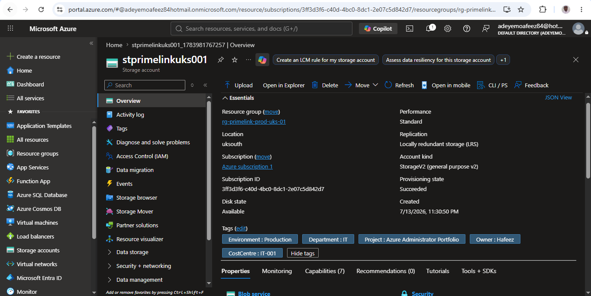
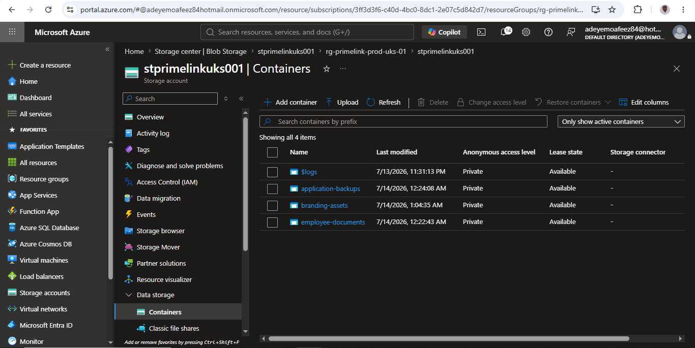
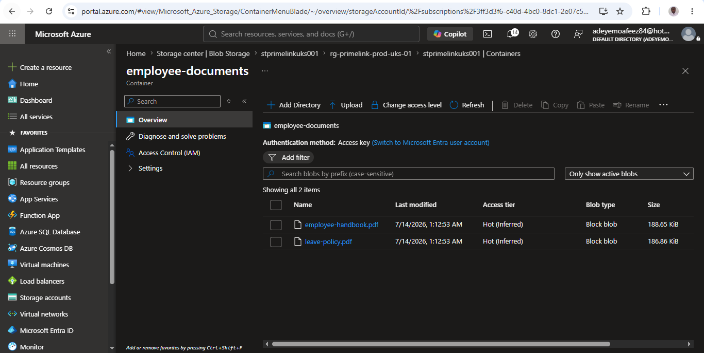
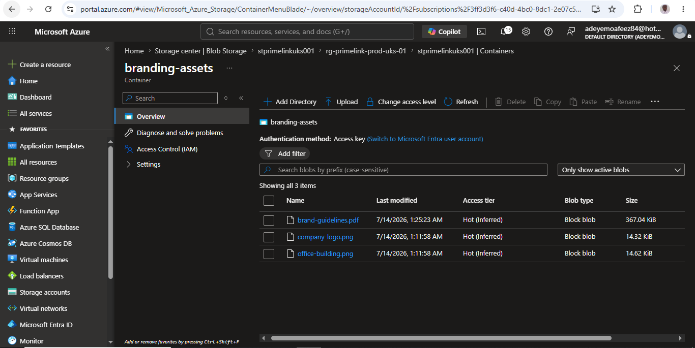
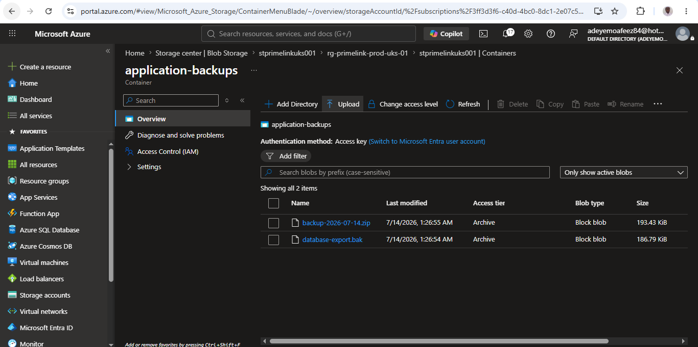
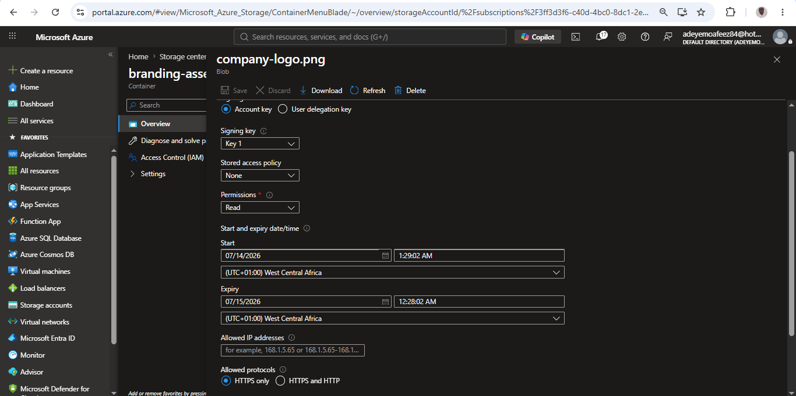
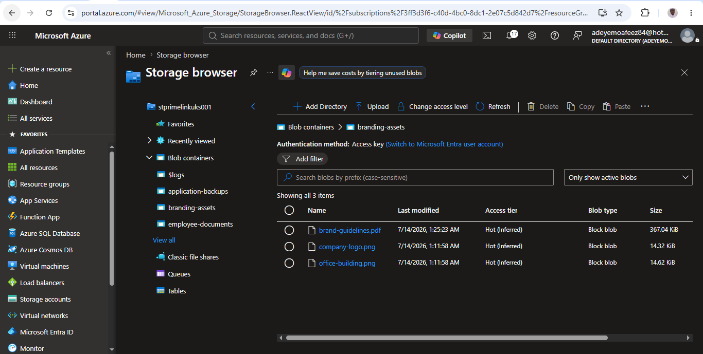

# Enterprise Azure Storage Account Administration

---

## Project Objectives

This project was designed to:

- Deploy an Azure Storage Account.
- Configure secure storage settings.
- Organize enterprise data using Blob Containers.
- Apply storage access tiers.
- Implement secure file sharing using SAS.
- Demonstrate Azure Storage administration following enterprise best practices.

> This project demonstrates the end-to-end deployment, configuration, security, and administration of Azure Storage services using enterprise best practices and real-world business requirements.
> 
---

## Project Information

| Property | Value |
|----------|-------|
| Project Number | 02 |
| Module | Azure Storage |
| Difficulty | Beginner → Intermediate |
| Estimated Completion Time | 45–60 minutes |
| Azure Services Used | Azure Storage Account, Azure Blob Storage |
| Deployment Method | Azure Portal |
| Status | ✅ Completed | 

---

# Business Scenario

PrimeLink Solutions Ltd. is expanding its cloud infrastructure to securely store company documents, application backups, images, and internal reports.

The organization requires a centralized cloud storage solution that provides high availability, secure access, scalability, and cost-effective storage management.

As the Azure Administrator, I have been assigned to deploy and configure an Azure Storage Account following Microsoft's recommended security and governance best practices while ensuring the solution supports future business growth.

---

# Business Requirements

The storage solution must:

- Provide secure cloud storage for business data.
- Support high availability and durability.
- Prevent unauthorized public access.
- Support future application integration.
- Follow Azure security and governance best practices.
- Be cost-effective for a growing business. 

---

# Azure Services and Features Used

| Service / Feature | Purpose |
|-------------------|---------|
| Azure Storage Account | Provides scalable and durable cloud storage for business data. |
| Azure Blob Storage | Stores unstructured data such as documents, images, and backups. |
| Blob Container | Organizes blobs within the Storage Account. |
| Shared Access Signature (SAS) | Provides secure, time-limited access to storage resources. |
| Storage Account Keys | Authenticates administrative access to the Storage Account. |
| Soft Delete | Protects deleted blobs from permanent removal. |
| Secure Transfer Required | Ensures data is transferred securely over HTTPS. |

---

## Performance Selection

Standard performance was selected because the organization primarily stores documents, backups, and images. Premium performance was unnecessary for the expected workload and would have increased operational costs.

---

# Network Configuration

## Public Network Access

> **Business Decision**
>
> Public network access was enabled during the learning phase to simplify administration and testing. Private networking will be introduced in a later project.

## Network Scope

Access was permitted from all networks because dedicated virtual networking and private endpoints have not yet been implemented.

## Routing Preference

Microsoft network routing was selected to use Microsoft's recommended backbone network for traffic between clients and Azure Storage.

## Security Configuration

The Storage Account was configured using the following security settings:

| Security Setting | Configuration |
|------------------|--------------|
| Secure Transfer | Enabled |
| TLS Version | 1.2 |
| Anonymous Access | Disabled |

---

## Storage Structure

The Storage Account was organized into separate Blob Containers based on business function.

| Blob Container | Purpose |
|---------------|---------|
| employee-documents | Stores HR documents and internal employee records. |
| branding-assets | Stores branding assets, marketing materials, company logos, and brand guidelines. |
| application-backups | Stores application backup files and exported data. |

---

# Sample Business Data

Representative business files were uploaded to each Blob Container to simulate a production environment.

| Blob Container | Sample Files | Access Tier |
|----------------|--------------|-------------|
| employee-documents | employee-handbook.pdf, leave-policy.pdf | Hot |
| branding-assets | company-logo.png, office-building.png, brand-guidelines.pdf | Hot |
| application-backups | backup-2026-07-14.zip, database-export.bak | Archive |

---

# Storage Tier Decisions

Azure Blob Storage access tiers were selected based on expected business usage patterns.

| Access Tier | Business Use Case | Reason |
|--------------|------------------|--------|
| Hot | Employee Documents | Frequently accessed by Human Resources staff. |
| Hot | Branding Assets | Marketing materials are accessed regularly for campaigns and company communications. |
| Archive | Application Backups | Backup files are retained for disaster recovery and are rarely accessed, helping reduce long-term storage costs. |

Selecting the appropriate access tier improves operational efficiency while optimizing Azure storage costs.

---

## Shared Access Signature (SAS)

A Blob-level Shared Access Signature (SAS) was configured to securely share a single company asset with an external organization.

### Configuration

| Setting | Value |
|---------|-------|
| Resource | company-logo.png |
| Signing Method | Account Key |
| Permission | Read |
| Protocol | HTTPS Only |
| Expiration | 24 Hours |
| Container Access | Private |

### Business Justification

Rather than making the entire Blob Container public, a Blob-level SAS was used to provide temporary, read-only access to a single file. This follows the Principle of Least Privilege by granting only the permissions required for the external design agency.

---

# Business Value

This solution provides a secure, scalable, and cost-effective cloud storage platform for PrimeLink Solutions Ltd.

This implementation demonstrates how Azure Storage can be deployed using enterprise governance, security, and cost optimization principles while remaining scalable for future business growth.

---

# Skills Demonstrated

After completing this project, I can confidently:

- Deploy an Azure Storage Account.
- Configure storage redundancy using Locally Redundant Storage (LRS).
- Configure Storage Account security settings.
- Organize enterprise data using Blob Containers.
- Upload and manage Blob objects.
- Select appropriate Azure Storage access tiers.
- Configure Blob Soft Delete for data protection.
- Generate and configure Blob-level Shared Access Signatures (SAS).
- Apply secure file-sharing principles using temporary access tokens.

---

# Lessons Learned

Throughout this project, I learned that successful Azure Storage administration involves more than simply creating resources.

Key lessons include:

- Designing storage based on business requirements rather than technical defaults.
- Organizing data into separate Blob Containers for better governance and management.
- Selecting appropriate access tiers to balance performance and storage costs.
- Using Shared Access Signatures (SAS) to securely share individual files without exposing an entire Storage Account.
- Applying the Principle of Least Privilege when granting access permissions.
- Documenting implementation decisions improves maintainability and knowledge transfer.

---

# Implementation Evidence

## Storage Account Overview

The Storage Account was successfully deployed using enterprise naming conventions and governance best practices.

---

## Blob Containers

Business data was organized into separate Blob Containers according to departmental responsibilities.

---

## Employee Documents

The Human Resources container stores employee-related documents that require frequent access.

---

## Branding Assets

The Marketing container stores branding resources that are accessed regularly by internal teams and approved external partners.

---

## Application Backups

The Application Backups container stores long-term backup files using the Archive access tier to optimize storage costs while maintaining data durability for disaster recovery.

---

## SAS Configuration

A Blob-level Shared Access Signature (SAS) was configured to securely provide temporary, read-only access to a single file while keeping the Blob Container private.

---

## Storage Browser

Azure Storage Browser was used to verify the Storage Account structure and manage Blob Containers and business data through a centralized management interface.

---

# Future Enhancements

Future improvements to this solution may include:

- Private Endpoints
- Microsoft Entra ID authentication
- User Delegation SAS
- Lifecycle Management policies
- Azure Monitor Integration
- Azure Backup integration

---

# Conclusion

This project forms part of my Azure Administrator portfolio and demonstrates practical experience in deploying, securing, and managing Azure Storage services using real-world business scenarios.

The knowledge and implementation experience gained from this project provide a strong foundation for future Azure networking, identity, monitoring, and governance projects within this portfolio.

---

## Next Project

**Next Project → Azure Virtual Networks**