# Enterprise Azure Virtual Network Deployment

> This project demonstrates the planning, deployment, segmentation, and security of an enterprise Azure Virtual Network using Azure Virtual Network, Subnets, and Network Security Groups (NSGs) following Microsoft best practices.
 

---

# Project Information

| Property | Value |
|----------|-------|
| Project Number | 03 |
| Module | Azure Networking |
| Difficulty | Intermediate |
| Estimated Completion Time | 60–90 Minutes |
| Azure Services Used | Azure Virtual Network, Subnets, Network Security Groups (NSGs) |
| Deployment Method | Azure Portal |
| Status | ✅ Completed |

---

# Business Scenario

PrimeLink Solutions Ltd. is expanding its cloud infrastructure to host a three-tier enterprise application consisting of a public-facing web application, an internal application layer, and a backend database.

To improve security, scalability, and traffic management, the organization requires a segmented Azure Virtual Network that isolates workloads into dedicated subnets while enforcing controlled communication using Network Security Groups (NSGs).

As the Azure Administrator, I was responsible for designing and deploying the virtual network, implementing subnet segmentation, associating NSGs, and configuring security rules based on the principle of least privilege.

---

# Business Requirements

- Deploy an isolated Azure Virtual Network for enterprise resources.
- Segment workloads into dedicated Web, Application, and Database subnets.
- Control network traffic between application tiers using Network Security Groups (NSGs).
- Enforce least-privilege security policies by applying subnet-level network security.
- Design a scalable network architecture capable of supporting future business growth. 

---

# Business Justification

Implementing a properly designed Azure Virtual Network enables the organization to securely host cloud workloads while improving network segmentation, strengthening administrative control, supporting scalability, and enhancing long-term operational efficiency.

- Secure communication between Azure resources.
- Logical separation of workloads.
- Easier administration and troubleshooting.
- Reduced attack surface through subnet isolation.
- Scalability for future business growth.

---

# Sample Business Data

| Resource               | Purpose                               |
| ---------------------- | ------------------------------------- |
| Virtual Network        | Corporate Production Network          |
| Application Subnet     | Hosts future application servers      |
| Database Subnet        | Hosts future SQL servers              |
| Network Security Group | Controls inbound and outbound traffic |
| Public IP              | Future secure external connectivity   |

---

# Architecture Overview

The deployed solution follows a secure three-tier enterprise network architecture consisting of dedicated Web, Application, and Database tiers. Each workload is isolated within its own subnet and protected by a dedicated Network Security Group (NSG), allowing traffic to be controlled according to business and security requirements while reducing the overall attack surface.

---

# Virtual Network Design

| Component | Configuration |
|----------|---------------|
| Virtual Network | vnet-primelink-prod-uks-01 |
| Address Space | 10.10.0.0/16 |
| Region | UK South |
| Resource Group | rg-primelink-prod-uks-01 |

---

# Subnet Design

| Subnet | Address Range | Purpose |
|---------|---------------|---------|
| snet-web-prod-uks-01 | 10.10.1.0/24 | Public-facing Web Servers |
| snet-app-prod-uks-01 | 10.10.2.0/24 | Internal Application Servers |
| snet-db-prod-uks-01 | 10.10.3.0/24 | Backend Database Servers |

---

# Network Security Rules

Network Security Groups (NSGs) were configured to enforce a layered security model across the enterprise virtual network.

- **Web subnet** accepts HTTPS (TCP 443) traffic from the Internet.
- **Web subnet** forwards application requests to the Application subnet over TCP 8080.
- **Application subnet** accepts traffic only from the Web subnet.
- **The Application subnet** communicates securely with the Database subnet over TCP 1433.
- **Database subnet** accepts SQL traffic only from the Application subnet.
- **All other inbound traffic** is denied by Azure's default NSG rules.

The implemented security model follows a layered defense strategy. Public traffic is permitted only where required, while internal communication is restricted to authorized application tiers. Azure's default Network Security Group rules continue protecting the environment by denying unsolicited inbound traffic that is not explicitly permitted.
    
---

# Network Design Decisions

The network architecture was designed following Microsoft Azure and enterprise networking best practices.

- A dedicated Virtual Network was deployed to provide an isolated cloud network for enterprise resources.
- Separate Web, Application, and Database subnets were created to enforce workload isolation and improve network segmentation.
- Individual Network Security Groups (NSGs) were assigned to each subnet, allowing security policies to be managed independently.
- HTTPS (TCP 443) access was permitted only to the Web subnet, preventing direct Internet access to internal application and database resources.
- Communication between application tiers was restricted using subnet-specific security rules based on the Principle of Least Privilege (PoLP)
- The network design supports future scalability by allowing additional resources to be deployed without redesigning the virtual network architecture.

---

# Implementation Evidence

### 01. Virtual Network Overview

Displays the successfully deployed Azure Virtual Network, including the resource group, region, and configured IPv4 address space.

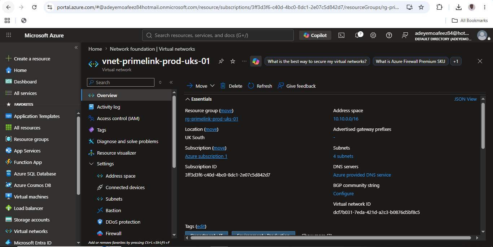

---

### 02. Subnet Configuration

Shows the enterprise subnet segmentation created for the Web, Application, and Database workloads.

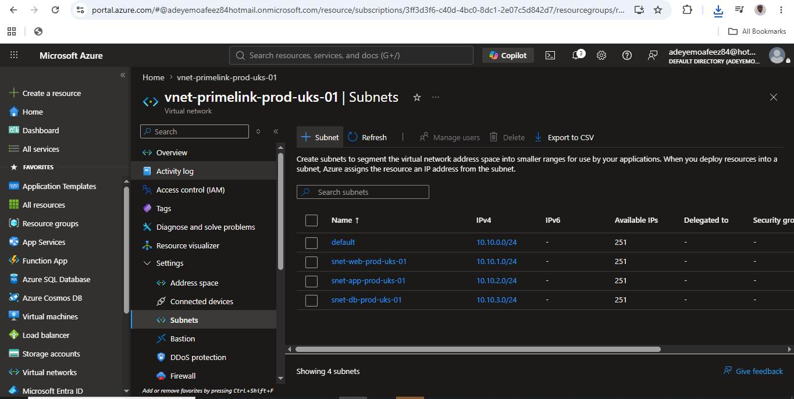

---

### 03. Web NSG Overview

Displays the Network Security Group protecting the Web subnet.

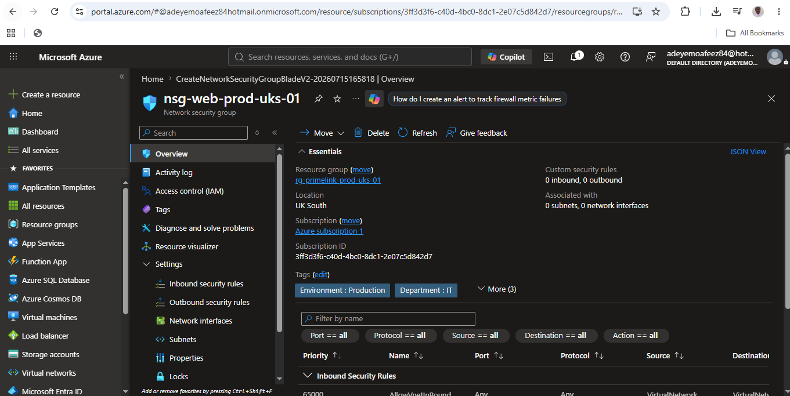

---

### 04. Web NSG Association

Associates the Web Network Security Group with the Web subnet, ensuring that all resources deployed within the subnet inherit the same security policies.

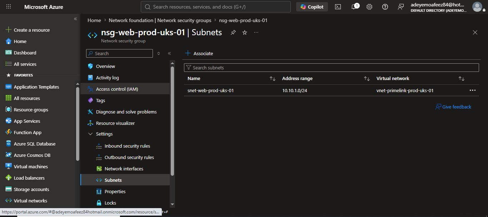

---

### 05. HTTPS Inbound Security Rule

Shows the inbound security rule allowing secure HTTPS (TCP 443) traffic from the Internet to the Web subnet while maintaining Azure's default deny policy for all other unsolicited inbound traffic.

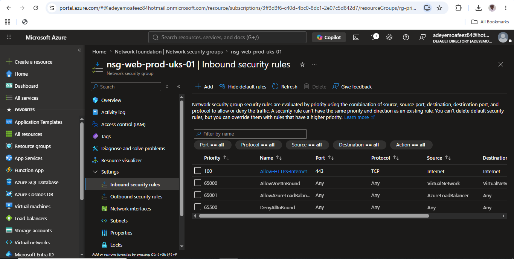

---

### 06. Application NSG Overview

Displays the Network Security Group created to protect the Application subnet and manage communication between application workloads.

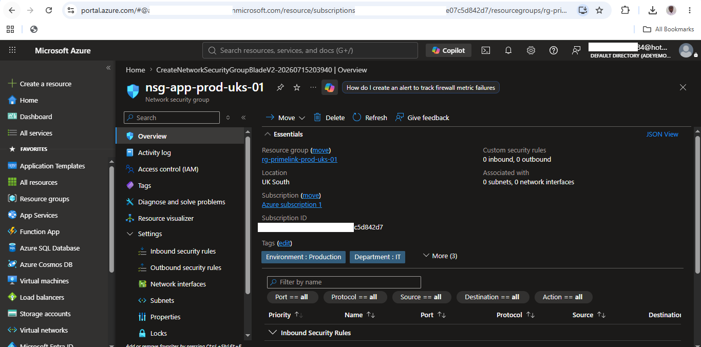

---

### 07. Application NSG Association

Demonstrates the successful association of the Application Network Security Group with the Application subnet, ensuring centralized subnet-level security is consistently enforced.

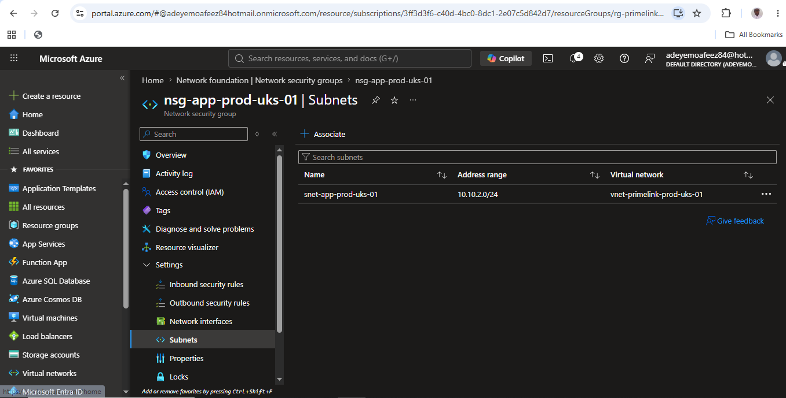

---

### 08. Database NSG Overview

Displays the Network Security Group created to secure the Database subnet and protect backend resources from unauthorized network access.

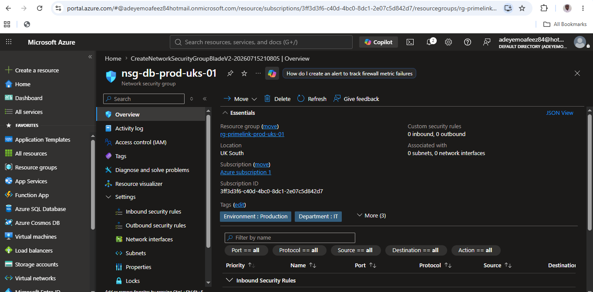

---

### 09. Database NSG Association

Illustrates the successful association of the Database Network Security Group with the Database subnet, ensuring security policies are consistently applied to database resources.

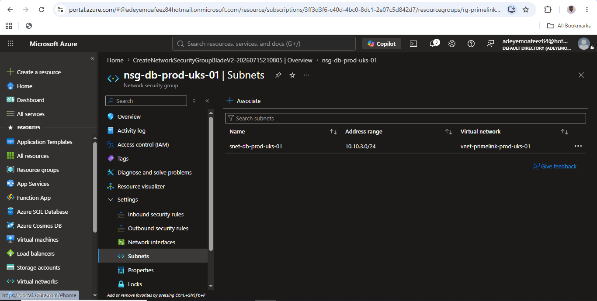

---

### 10. Web Outbound Security Rule

Displays the outbound security rule permitting the Web subnet to communicate securely with the Application subnet over TCP port 8080 as part of the three-tier enterprise architecture.

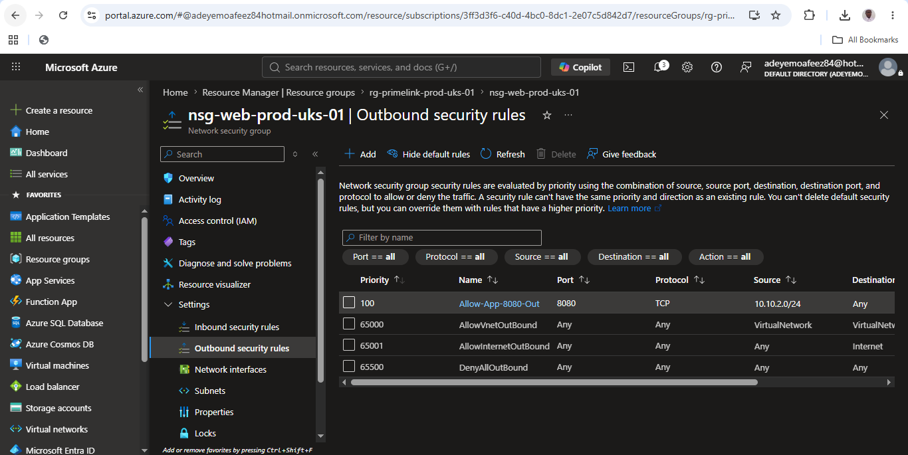

---

### 11. Application Inbound Security Rule

Shows the inbound security rule allowing only the Web subnet to communicate with the Application subnet over TCP port 8080, enforcing controlled inter-tier communication.

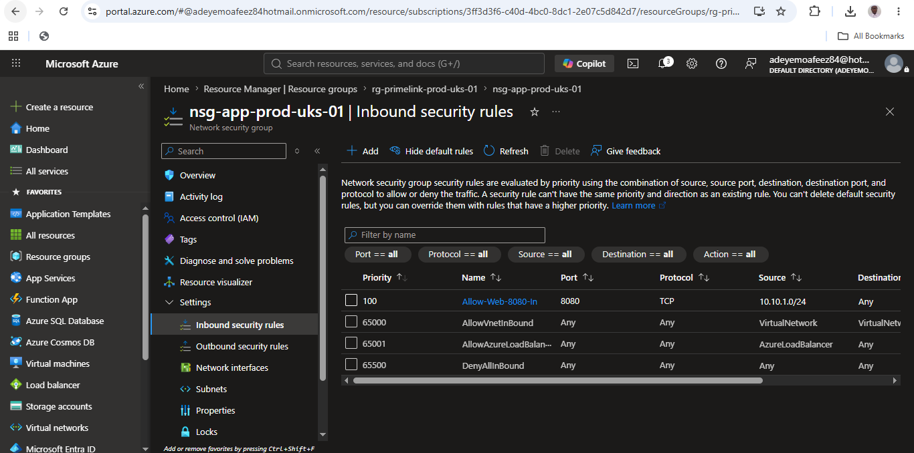

---

### 12. Application Outbound Security Rule

Demonstrates the outbound security rule allowing the Application subnet to communicate with the Database subnet over TCP port 1433 while maintaining secure network segmentation.

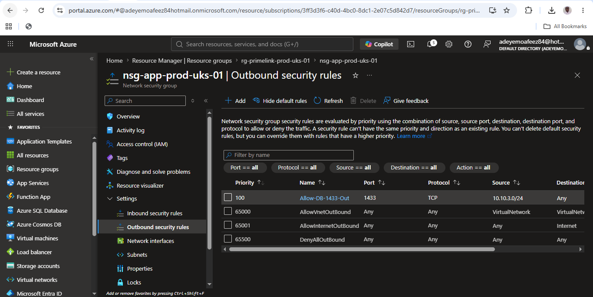

---

### 13. Database Inbound Security Rule

Shows the inbound security rule allowing SQL traffic (TCP port 1433) only from the Application subnet, preventing direct access to database resources from unauthorized sources.

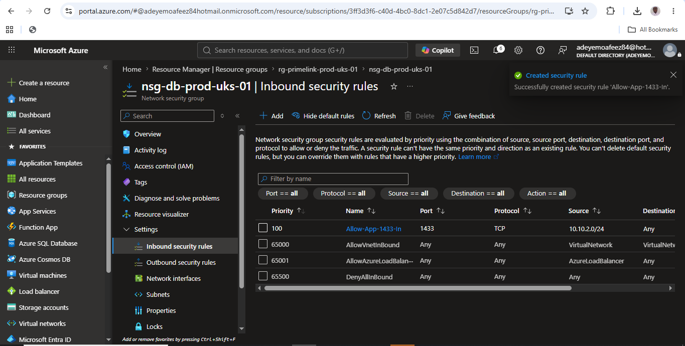

---

# Skills Demonstrated

- Azure Virtual Network (VNet)
- IPv4 Address Planning
- Subnet Segmentation
- Network Security Groups (NSGs)
- Inbound and Outbound Security Rules
- Enterprise Network Design
- Principle of Least Privilege

---

# Lessons Learned

Throughout this project, I gained practical experience in:

- Designing Azure Virtual Networks using enterprise naming conventions.
- Planning IPv4 address spaces and subnet segmentation.
- Implementing subnet-level Network Security Groups.
- Configuring inbound and outbound security rules.
- Applying the Principle of Least Privilege to network design.
- Understanding Azure's default NSG security rules and stateful firewall behavior.
- Building scalable and secure network architectures suitable for enterprise environments.

---

# Future Enhancements

Future improvements to this network architecture may include:

- Azure Bastion
- Azure Firewall
- Azure VPN Gateway
- Azure Load Balancer
- Network Watcher
- Azure DDoS Protection Standard

---

# Conclusion

This project successfully demonstrated the design and deployment of a secure enterprise Azure Virtual Network using industry best practices for network segmentation and workload isolation. By implementing dedicated subnets, Network Security Groups, and least-privilege security policies, the environment is prepared to securely support future Azure workloads and enterprise applications.

---

# Next Project

➡️ **Next Project:** Azure Virtual Machines Administration

Continue to **Project 04**, where I deploy and administer Azure Virtual Machines, configure networking, storage, and secure remote management following enterprise best practices.