# Project 04 – Enterprise Azure Virtual Machine Administration

---

---

## Project Summary

This project demonstrates the deployment, administration, monitoring, security, and lifecycle management of a Windows Server 2022 Virtual Machine in Microsoft Azure using enterprise best practices. It builds on the networking infrastructure created in Project 03 and focuses on secure deployment, private networking, cost optimization, and operational management.

---

## Project Information

| Property | Value |
|----------|-------|
| Project Number | 04 |
| Module | Azure Virtual Machines |
| Difficulty | Intermediate |
| Estimated Completion Time | 3–4 Hours |
| Azure Services Used | Azure VM, VNet, NSG, Managed Disk, Azure Monitor |
| Deployment Method | Azure Portal |
| Status | ✅ Completed |

--- 

# Business Scenario

PrimeLink Solutions Ltd. is expanding its Azure infrastructure by deploying Windows Server virtual machines to host internal business applications. The IT department requires a secure, standardized, and scalable deployment that follows Azure best practices. Each Windows Server virtual machine must be deployed into the existing enterprise virtual network created in Project 03, secured using private networking, and administered according to organizational security, monitoring, and cost optimization standards.

---

## Objectives

- Deploy a production-style Windows Server 2022 virtual machine in Microsoft Azure.
- Reuse existing enterprise networking resources created in Project 03.
- Implement secure private networking with no public exposure.
- Configure Trusted Launch security features.
- Demonstrate monitoring, diagnostics, and cost optimization.
- Perform full virtual machine lifecycle management.

---

## Architecture Overview

The virtual machine was deployed into the existing enterprise networking infrastructure created in Project 03. The solution uses a private IP address, a managed OS disk, a dedicated network interface, and a Network Security Group (NSG) associated with the NIC to provide secure and isolated compute resources.

Resource Group
│
├── Virtual Network
│
├── Default Subnet (Current Deployment)
│
├── Web Subnet (Future Expansion)
│
├── App Subnet (Future Expansion)
│
├── Database Subnet (Future Expansion)
│
├── Windows Server 2022 VM
│
├── Managed Disk
│
├── Network Interface
│
├── Private IP Address
│
├── Network Security Group
│
└── Boot Diagnostics

Note: This project deploys the virtual machine into the existing Default subnet created in Project 03. Additional Web, Application, and Database subnets were designed for future workload segmentation as the environment grows.

---

## Azure Resources Used

- Azure Virtual Machine
- Azure Resource Group
- Azure Virtual Network
- Azure Subnet
- Azure Network Interface
- Azure Network Security Group
- Managed Disk
- Boot Diagnostics
- Azure Monitor
- Activity Log

---

## Deployment Steps

1. Selected the existing Resource Group.
2. Selected the existing Virtual Network.
3. Selected the default subnet.
4. Configured a Windows Server 2022 Azure Edition VM.
5. Enabled Trusted Launch.
6. Enabled Secure Boot and vTPM.
7. Disabled Public IP assignment.
8. Configured Auto Shutdown.
9. Reviewed monitoring and diagnostics.
10. Tested VM lifecycle by deallocating, restarting, and deleting the VM.

---

## VM Configuration 

| Setting | Value |
|---------|-------|
| Operating System | Windows Server 2022 Datacenter: Azure Edition |
| Region | UK South |
| VM Size | Standard D2s v3 |
| Availability | No Infrastructure Redundancy |
| Security | Trusted Launch |
| Secure Boot | Enabled |
| vTPM | Enabled |
| Accelerated Networking | Enabled |
| Disk | Standard SSD |
| Public IP | None |

---

## Network Configuration

| Component | Configuration |
|-----------|--------------|
| Virtual Network | vnet-primelink-prod-uks-01 |
| Subnet | Default |
| Private IP | Assigned |
| Public IP | None |
| Network Interface | One |
| NSG Association | Network Interface |

---

## Security Configuration 

The virtual machine was intentionally deployed without a Public IP address and with Public Inbound Ports disabled.

This follows the Principle of Least Privilege by preventing direct administrative access from the Internet.

In production environments, administrators would normally access the VM using:

- Azure Bastion
- Site-to-Site VPN
- ExpressRoute
- Jump Server (Management Network)

---

## Cost Optimization

The following measures were implemented to minimize Azure costs:

- Standard SSD instead of Premium SSD
- Auto Shutdown enabled
- Virtual machine manually deallocated during testing to stop compute charges.
- Public IP not provisioned
- VM deleted after project completion
- Existing network resources reused

---

## Infrastructure as Code

Although this project demonstrates Azure Portal deployment for learning purposes, the same virtual machine configuration can be deployed repeatedly using ARM Templates or Bicep.

Infrastructure as Code provides:

- Consistent deployments
- Reduced human error
- Reusability
- Faster provisioning
- Easy horizontal scaling for enterprise environments

---

## Deployment Challenge

During deployment, I encountered an Azure subscription quota limitation that prevented the use of the Standard Bsv2 virtual machine family in the UK South region. After investigating the issue, I submitted a quota increase request, reviewed the available compute SKUs, and evaluated alternative VM sizes.

To keep the project moving while maintaining enterprise deployment standards, I selected the Standard D2s v3 virtual machine, which satisfied the project requirements and was immediately available in the selected region.

This experience reinforced the importance of understanding Azure regional capacity, subscription quotas, resource planning, and selecting appropriate alternatives when cloud resources are constrained.

---

## Administrator Decisions

| Decision                | Reason                                |
| ----------------------- | ------------------------------------- |
| No Public IP            | Reduced attack surface                |
| Trusted Launch          | Improved platform security            |
| Standard SSD            | Balanced cost and performance         |
| Existing VNet           | Resource reuse and consistency        |
| Existing Resource Group | Centralized management                |
| Private Networking      | Enterprise security                   |
| Auto Shutdown           | Cost optimization                     |
| ARM/Bicep for scaling   | Repeatability and reduced human error |

---

## Lessons Learned

- Azure VM deployment requires careful planning of compute, storage, networking, and security.
- Enterprise naming standards improve resource organization.
- Private networking significantly reduces attack surface.
- Trusted Launch provides Secure Boot and vTPM protection.
- Azure subscription quotas can influence deployment planning.
- Auto-shutdown helps reduce operational costs during development.
- Virtual Machines should be deleted after testing to avoid unnecessary charges.

---

## Best Practices Implemented

- Enterprise resource naming convention
- Existing Resource Group reuse
- Existing Virtual Network reuse
- Network Security Group protection
- No Public IP Address
- No inbound RDP exposure
- Trusted Launch enabled
- Secure Boot enabled
- vTPM enabled
- Accelerated Networking enabled
- Standard SSD managed disk
- Auto-shutdown configured
- Resource tagging

---

## Interview Questions

### Why did you deploy the VM without a Public IP?

To reduce the attack surface by preventing direct Internet access. Administrative access should occur through Azure Bastion, VPN, ExpressRoute, or a jump server.

---

### Why did you enable Trusted Launch?

Trusted Launch enables Secure Boot and vTPM to protect against bootkits, rootkits, and firmware attacks.

---

### Why did you choose a private IP instead of a public IP?

The virtual machine hosts internal enterprise workloads and therefore does not require direct internet exposure. Using only a private IP address significantly reduces the attack surface and aligns with the Principle of Least Privilege. Administrative access should be provided through Azure Bastion, VPN, or ExpressRoute rather than exposing Remote Desktop to the internet.

---

### Why use Standard SSD?

Standard SSD provides a balance between performance and cost for general-purpose enterprise workloads.

---

### Why configure Auto Shutdown?

Auto Shutdown minimizes compute costs by automatically stopping the VM outside business hours.

---

### Why delete the VM after testing?

Deleting unused resources prevents unnecessary Azure charges while maintaining a clean environment.

---

## Documentation Evidence

The following screenshots provide deployment evidence captured throughout the project lifecycle. They demonstrate the planning, deployment, administration, monitoring, security configuration, lifecycle management, and cost optimization of the Azure Virtual Machine using Microsoft Azure Portal.

---

# Screenshot Gallery

## 01. Azure Virtual Machine List

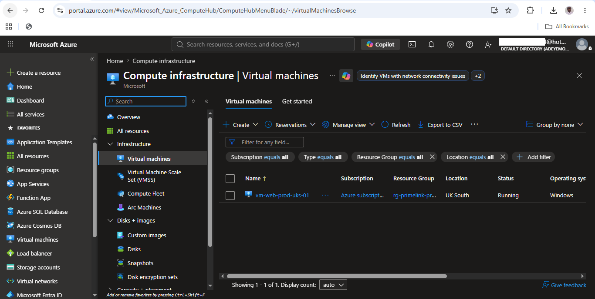

Displays the deployed virtual machine within the Azure subscription, confirming its successful creation, current running state, region, operating system, and resource group.

---

## 02. Virtual Machine Overview

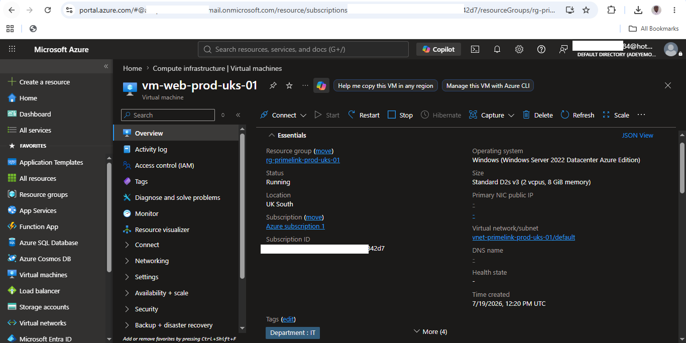

Shows the Windows Server 2022 virtual machine overview, including deployment status, VM size, operating system, networking, and resource configuration.

---

## 03. Network Configuration

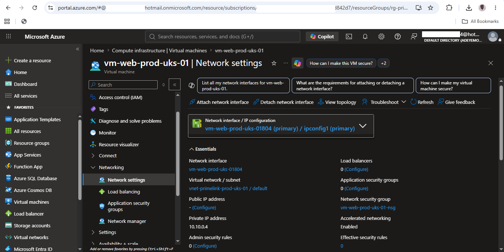

Illustrates the VM network interface connected to the existing enterprise Virtual Network and subnet using a private IP address with no public exposure.

---

## 04. Managed Disk Configuration

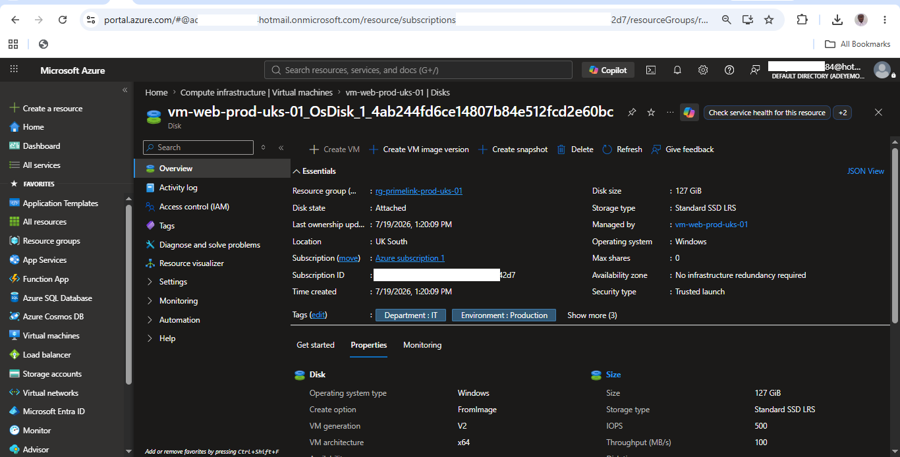

Demonstrates the managed OS disk configuration using Standard SSD storage for a balance of performance, reliability, and cost optimization.

---

## 05. Security Configuration

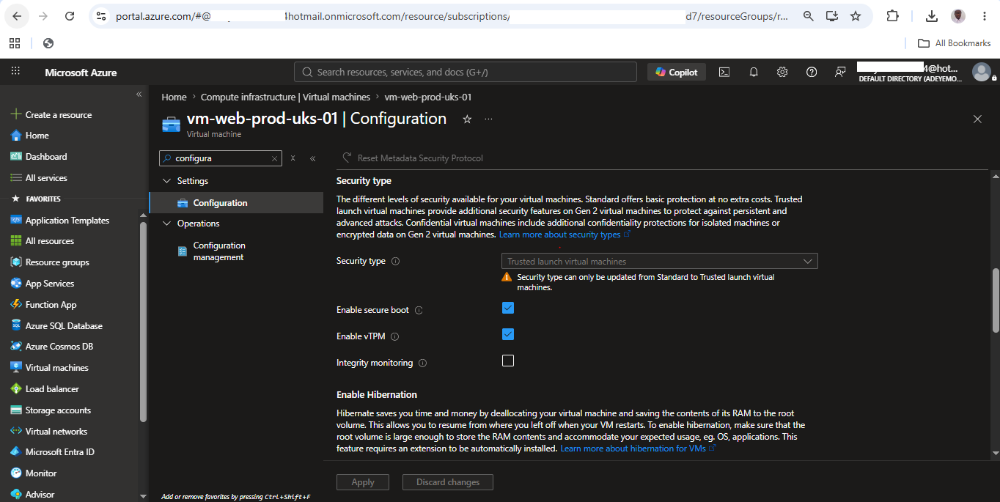

Shows Trusted Launch security enabled with Secure Boot and virtual TPM (vTPM), providing enhanced protection against boot-level and firmware attacks.

---

## 06. Virtual Machine Extensions

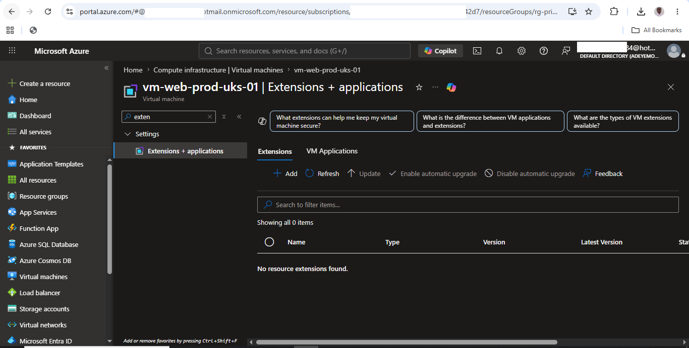

Displays the Extensions blade used to install and manage additional software and automation tools for enterprise virtual machines.

---

## 07. Boot Diagnostics

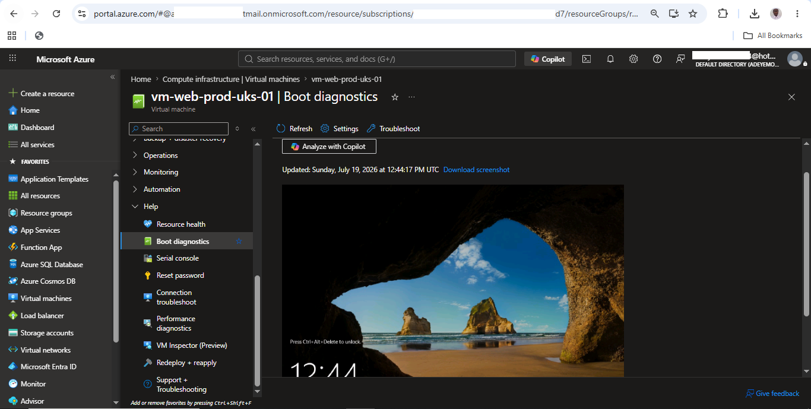

Demonstrates Azure Boot Diagnostics, which assists administrators in troubleshooting virtual machine startup and operating system issues.

---

## 08. Virtual Machine Size

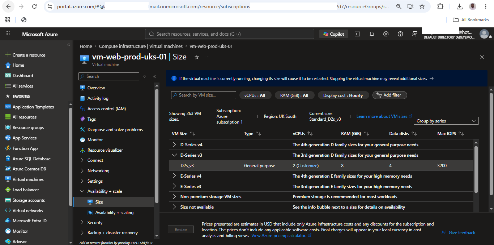

Shows the selected VM SKU (Standard D2s v3), providing the compute resources required while balancing cost and performance for enterprise workloads.

---

## 09. Auto Shutdown Configuration

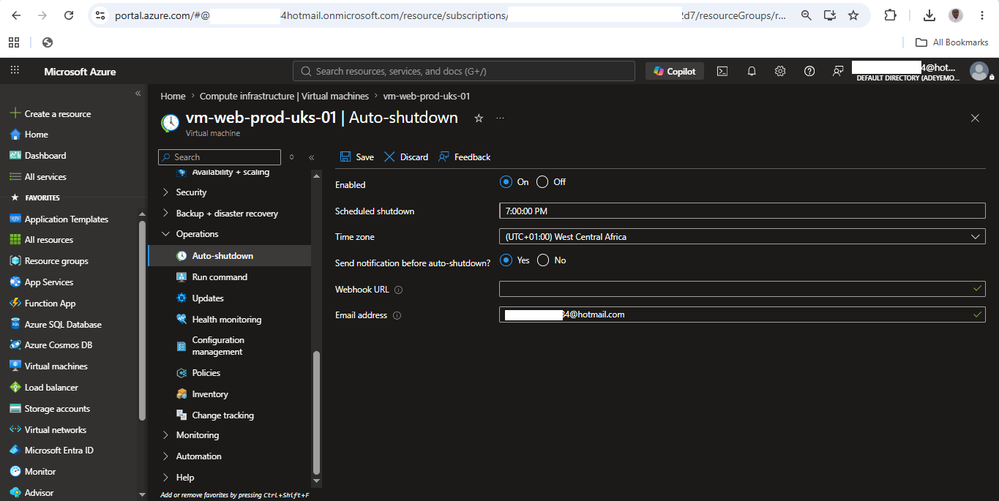

Illustrates the scheduled Auto Shutdown feature used to automatically stop the virtual machine outside business hours, reducing unnecessary compute costs.

---

## 10. Virtual Machine Deletion

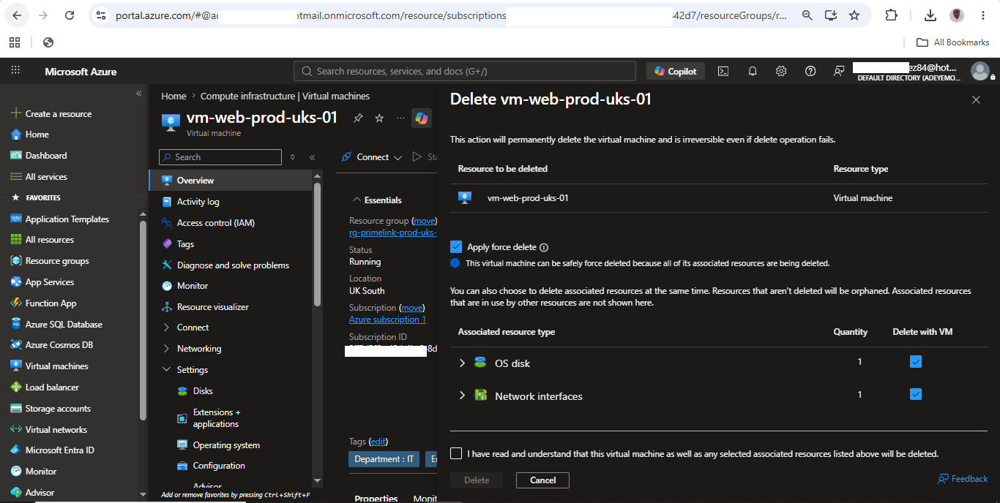

Shows the deletion options configured to automatically remove associated resources such as the OS disk and network interface, preventing orphaned resources and unnecessary charges.

---

## 11. Secure RDP Configuration

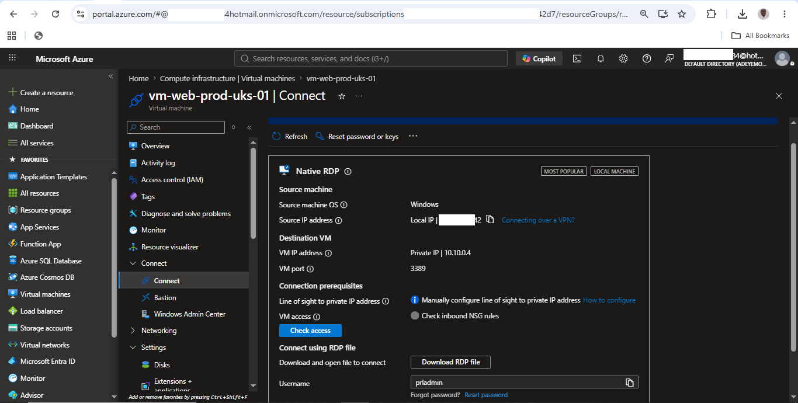

Demonstrates that Remote Desktop access is intentionally unavailable because the virtual machine has no public IP address and follows the Principle of Least Privilege.

---

## 12. Resource Visualizer

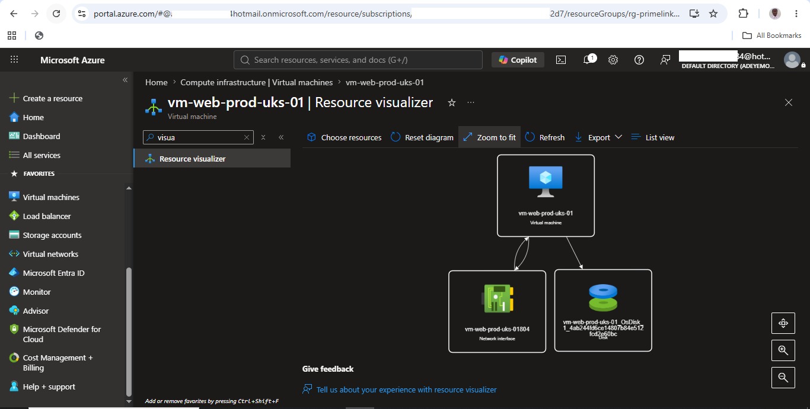

Illustrates the relationships between the virtual machine, managed disk, network interface, virtual network, and network security group within the Azure resource architecture.

---

## 13. Azure Monitor Metrics

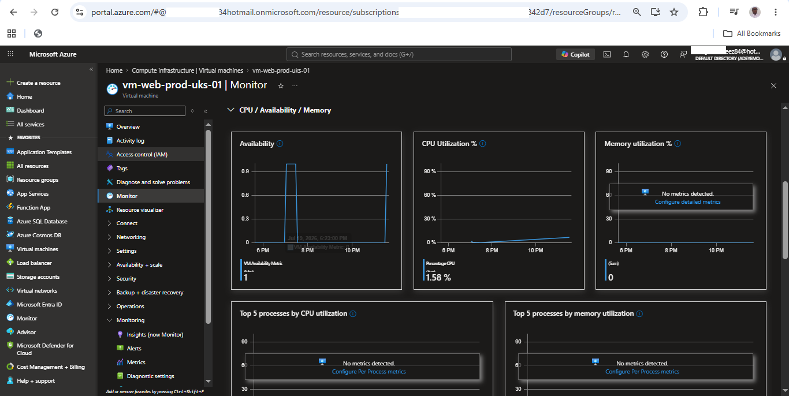

Displays Azure Monitor metrics used to observe CPU utilization, network activity, and overall virtual machine performance for operational monitoring.

---

## 14. Cost Optimization (VM Deallocated)

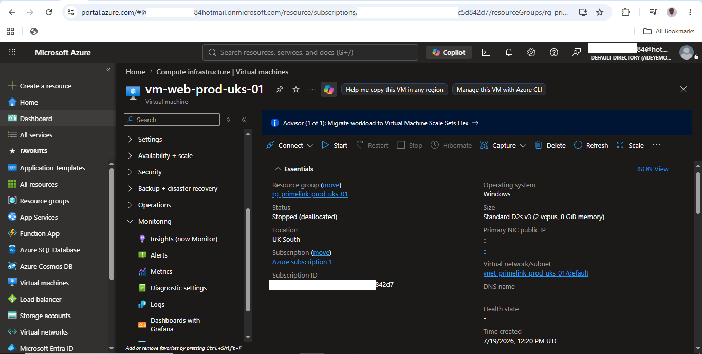

Shows the virtual machine in a **Stopped (Deallocated)** state, demonstrating Azure cost optimization by releasing compute resources while preserving the VM configuration.

---

## 15. Custom Network Security Rule

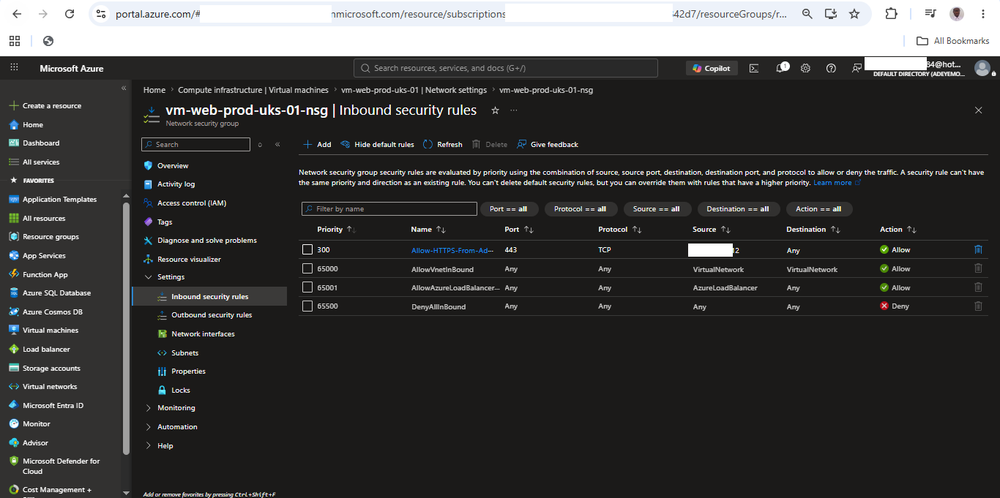

Demonstrates the creation of a temporary HTTPS inbound Network Security Group (NSG) rule restricted to the administrator's public IP address. The rule was removed after testing to maintain the Principle of Least Privilege.

---

## Skills Demonstrated

This project now demonstrates:

- Azure Virtual Machines
- Azure Networking
- Azure Virtual Networks
- Azure Network Interfaces
- Azure NSGs
- Azure Monitoring
- Azure Boot Diagnostics
- Azure Activity Log
- Azure Resource Visualizer
- Azure Cost Optimization
- Azure Security
- Azure Compute
- Infrastructure as Code concepts (ARM/Bicep)

---

## Enterprise Concepts Applied

- Principle of Least Privilege (PoLP)
- Defense in Depth
- Infrastructure as Code (IaC)
- Resource Standardization
- Enterprise Naming Convention
- Cost Optimization
- Resource Lifecycle Management
- Private Network Architecture
- Secure Administrative Access

---

## Custom Script Extension  

Although no extensions were installed during this project, the Extensions blade was reviewed to understand how enterprise administrators deploy software, monitoring agents, and automation scripts across multiple virtual machines. 

---

## Project Outcome

This project successfully demonstrated the deployment and administration of a secure Windows Server 2022 virtual machine within an existing Azure enterprise network. Throughout the project, I applied security best practices, implemented cost optimization techniques, reviewed monitoring and diagnostics, managed the virtual machine lifecycle, and documented the deployment using enterprise standards. This project also reinforced the importance of infrastructure planning, subscription quota management, and secure cloud administration in Microsoft Azure.

---

## Next Project

Project 05 will focus on Microsoft Entra ID, including identity management, authentication, role-based access control (RBAC), and enterprise identity administration in Microsoft Azure.