# Project 05 – Enterprise Microsoft Entra ID Identity & Access Management 

---


---

## 📋 Project Information

| Item | Details |
| :--- | :--- |
| **Project** | 05 |
| **Title** | Enterprise Microsoft Entra ID Identity & Access Management |
| **Environment** | ☁️ Microsoft Azure |
| **Directory** | 🆔 Microsoft Entra ID (Free) |
| **Resource Group** | `rg-primelink-prod-uks-01` |
| **Implementation** | 🖥️ Azure Portal |
| **Status** | 🟢 Completed |
| **Portfolio Track** | 🛠️ AZ-104 Azure Administrator |

---

## Project Overview

This project demonstrates **enterprise identity and access management** using **Microsoft Entra ID** and **Azure Role-Based Access Control (Azure RBAC)**.

The implementation follows **enterprise best practices** by provisioning **cloud-only administrator accounts**, organizing identities using **Security Groups**, and assigning Azure permissions through **group-based RBAC** instead of direct user assignments.

The project emphasizes the **Principle of Least Privilege**, **scalable identity management**, and the separation of **authentication**, **authorization**, and **resource administration**.

---

## Business Scenario

**PrimeLink Solutions Ltd.** is expanding its cloud infrastructure and requires a secure, scalable identity management solution for its IT operations team.

Instead of assigning Azure permissions directly to individual users, the organization implements **Microsoft Entra Security Groups** and Azure **Role-Based Access Control (RBAC)** to simplify administration, improve governance, and reduce administrative overhead.


---

## Project Objectives

- Implement Microsoft Entra cloud identities
- Create enterprise administrator accounts
- Organize identities using Security Groups
- Implement Azure Role-Based Access Control (RBAC)
- Apply the Principle of Least Privilege
- Demonstrate enterprise identity governance

---

## Key Features

- Cloud-only administrator accounts
- Enterprise Security Groups
- Azure RBAC
- Resource Group scoped permissions
- Group-based authorization
- Identity lifecycle management
- Least Privilege implementation

---

## Technologies Used

- `Microsoft Entra ID`
- `Azure RBAC`
- `Azure Resource Groups`
- `Azure IAM`
- `Microsoft Entra Security Groups`
- `Microsoft Entra Users`
- `Azure Portal`

---

## Architecture Overview 

The following architecture illustrates how Microsoft Entra identities, Security Groups, Azure RBAC, and Azure resources interact within the enterprise environment.

```text
                        ┌──────────────────────────────┐
                        │     Microsoft Entra ID       │
                        └──────────────┬───────────────┘
                                       │
                 ┌─────────────────────┴─────────────────────┐
                 ▼                                           ▼
┌─────────────────────────────────┐       ┌─────────────────────────────────┐
│  Cloud Administrator Accounts   │       │         Security Groups         │
└────────────────┬────────────────┘       └────────────────┬────────────────┘
                 │                                         │
                 └─────────────────────┬───────────────────┘
                                       │
                                       ▼
                        ┌──────────────────────────────┐
                        │  Azure Role-Based Access     │
                        │        Control (RBAC)        │
                        └──────────────┬───────────────┘
                                       │
                                       ▼
                        ┌──────────────────────────────┐
                        │            Scope:            │
                        │    Resource Group (IAM)      │
                        └──────────────┬───────────────┘
                                       │
                                       ▼
                        ┌──────────────────────────────┐
                        │   rg-primelink-prod-uks-01   │
                        └──────────────┬───────────────┘
                                       │
         ┌─────────────────────────────┼─────────────────────────────┐
         ▼                             ▼                             ▼
┌─────────────────┐           ┌─────────────────┐           ┌─────────────────┐
│ Virtual Machine │           │ Virtual Network │           │ Storage Account │
└────────┬────────┘           └─────────────────┘           └─────────────────┘
         │
         ▼
┌───────────────────────────────────────────────────────────────────────────┐
│                              Azure Resources                              │
│                (Permissions inherited through Azure RBAC)                 │
└───────────────────────────────────────────────────────────────────────────┘

```

---

## Enterprise Identity Structure

The following structure represents the logical organization of enterprise users and Security Groups implemented in this project.

```text
Microsoft Entra ID
│
├── Users
│   ├── PrimeLink Cloud Administrator
│   ├── PrimeLink Network Administrator
│   ├── PrimeLink Storage Administrator
│   ├── PrimeLink Helpdesk Administrator
│   └── PrimeLink Security Administrator
│
└── Security Groups
    ├── GG-IT-Admins
    │      └── PrimeLink Cloud Administrator
    │
    ├── GG-Network-Admins
    │      └── PrimeLink Network Administrator
    │
    ├── GG-Storage-Admins
    │      └── PrimeLink Storage Administrator
    │
    ├── GG-Helpdesk
    │      └── PrimeLink Helpdesk Administrator
    │
    └── GG-Security
           └── PrimeLink Security Administrator
```
---

## User Naming Convention

| User           | Display Name                     | Responsibility                      |
| ------------   | -------------------------------- | ----------------------------------- |
| `prl-admin`    | PrimeLink Cloud Administrator    | Azure Infrastructure Administration |
| `prl-network`  | PrimeLink Network Administrator  | Azure Networking                    |
| `prl-storage`  | PrimeLink Storage Administrator  | Azure Storage                       |
| `prl-helpdesk` | PrimeLink Helpdesk Administrator | Identity Support                    |
| `prl-security` | PrimeLink Security Administrator | Identity Security                   |

---

## Identity Design

Five cloud-only Microsoft Entra administrator accounts were provisioned to represent dedicated enterprise operational roles.

Each identity includes:

- Standardized naming convention
- Employee ID
- Department  
- Job title
- Company information
- Usage location
- Cloud-only authentication

The original Global Administrator account remained dedicated to tenant administration while operational responsibilities were delegated to role-specific administrator accounts.

---

## Enterprise Security Groups

| Security Group      | Purpose                                  |
| -----------------   | ---------------------------------------- |
| `GG-IT-Admins`      | Azure Infrastructure Administration      |
| `GG-Network-Admins` | Azure Networking Administration          |
| `GG-Storage-Admins` | Azure Storage Administration             |
| `GG-Helpdesk`       | User Support and Password Administration |
| `GG-Security`       | Identity and Security Administration     |

---

## Security Group Design

Security Groups were implemented to centralize permission management, simplify administration, and support enterprise scalability.

The following Security Groups were implemented:

- GG-IT-Admins
- GG-Network-Admins
- GG-Storage-Admins
- GG-Helpdesk
- GG-Security

Each group contains an assigned owner and member, providing accountability and simplifying future onboarding and offboarding processes.

---

## Azure RBAC Design

Azure permissions were assigned to Security Groups rather than directly to individual users.

This implementation follows enterprise RBAC best practices by allowing users to inherit permissions through group membership.

Implemented Azure Roles:

| Security Group | Azure Role |
|---------------|------------|
| `GG-IT-Admins` | `Virtual Machine Contributor` |
| `GG-Network-Admins` | `Network Contributor` |
| `GG-Storage-Admins` | `Storage Account Contributor` |

Each Azure role was assigned at the Resource Group scope, allowing permissions to be inherited by supported Azure resources while preventing unnecessary access beyond the workload boundary.

Rather than assigning permissions directly to individual users, Azure RBAC roles were assigned to Security Groups. This approach simplifies onboarding, offboarding, auditing, and long-term permission management while reducing administrative overhead.

---

## Implementation Notes and Design Decisions

### Design Decision 01 — Microsoft Entra Licensing
> **Enterprise Note:** 
> 
> This project was implemented using Microsoft Entra Free. In production environments, organizations often use Microsoft Entra ID P1 or P2 to enable advanced features such as Conditional Access, Dynamic Groups, Privileged Identity Management (PIM), and Identity Governance.

### Design Decision 02 — Password Configuration
>
> **Password Policy**
>
> An auto-generated temporary password was used during account provisioning. Users are required to change their password during their first successful sign-in.

### Design Decision 03 — Azure RBAC Scope
>
> **Azure RBAC Scope**
>
> Azure RBAC Conditions were unavailable because this assignment type does not support conditional configuration at the Resource Group scope. Standard RBAC role assignments at this scope do not require additional conditions.

### Design Decision 04 — Least Privilege Authorization
> Each administrator receives permissions based on their operational responsibilities while maintaining the Principle of Least Privilege.
>
> The objective is to ensure that only authorized users have access to Azure resources according to their job responsibilities, implementing the Principle of Least Privilege and Role-Based Access Control (RBAC).

### Design Decision 05 — Tenant Configuration
> The project was implemented in a personal Microsoft Entra tenant (Default Directory) while following enterprise identity management practices based on the fictional organization PrimeLink Solutions Ltd.
>
> In a production environment, organizations typically verify and use a custom domain rather than the default onmicrosoft.com domain.
>
> This tenant is administered using a Microsoft account rather than a cloud-only Microsoft Entra user.

---

## Enterprise Best Practices

- **Cloud-only administrator accounts**
- **Standardized naming conventions**
- **Group-based RBAC assignments**
- **Group-based permission inheritance**
- **Azure RBAC at Resource Group Scope**
- **Resource Group scoped permissions**
- **Separation of authentication and authorization**
- **Security Group ownership**
- **Least Privilege**
- **Enterprise onboarding and offboarding model**

---

## Deployment Challenges

During implementation, **Microsoft Entra Free** licensing limited access to advanced identity governance capabilities such as **Access Reviews** and **Privileged Identity Management (PIM).**

The solution was designed using Microsoft Entra Free while maintaining enterprise identity management principles. **Security Groups** and **Azure RBAC** were implemented using supported features, ensuring the environment remained production-oriented and reproducible without premium licensing.

---
## Lessons Learned

Through this project, I learned:

- The difference between **authentication** and **authorization.**
- The distinction between **Microsoft Entra** roles and **Azure RBAC** roles.
- Why enterprises assign Azure permissions to **Security Groups** instead of **individual users.**
- How **RBAC inheritance** simplifies administration.
- How group ownership improves **governance** and **accountability.**
- Why the **Principle of Least Privilege** is fundamental to enterprise identity management.

---

## 🎯 Project Outcome

This project successfully implemented an enterprise identity and access management solution using Microsoft Entra ID and Azure RBAC.

### Achievements

* **👤 Admin Provisioning**: Provisioned enterprise cloud-only administrator accounts.
* **👥 Group Management**: Created role-based Security Groups.
* **🔐 Access Control**: Implemented Azure RBAC using group-based authorization.
* **🛡️ Security Alignment**: Applied the Principle of Least Privilege.
* **📍 Scoped Permissions**: Implemented Resource Group scoped RBAC assignments.
* **🏢 Identity Governance**: Demonstrated enterprise onboarding and identity governance practices.

---

## Future Enhancements

Future enterprise improvements include:

- `Conditional Access` (Microsoft Entra ID P1)
- `Dynamic Security Groups`
- `Privileged Identity Management (PIM)`
- `Access Reviews`
- `Identity Governance`
- `Administrative Units`

---

## Portfolio Continuation

This project established enterprise identity and access management using Microsoft Entra ID and Azure RBAC.

The next project in this Azure Administrator Portfolio will extend the environment by implementing enterprise Azure Storage data management, including Azure Blob Storage, Azure Files, Shared Access Signatures (SAS), lifecycle management, and secure storage governance.

---

## References

- Microsoft Learn – Microsoft Entra ID
- Microsoft Learn – Azure Role-Based Access Control (Azure RBAC)
- Microsoft Learn – Azure Resource Groups
- Microsoft Learn – Azure Identity and Access Management
- Microsoft Learn – Microsoft Entra ID documentation

---

# Screenshot Gallery

| Step 01 to 02 | Step 03 to 04 |
| :--- | :--- |
| **01. Microsoft Entra Overview**<br><br>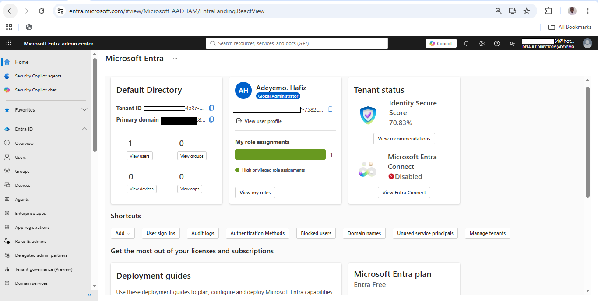<br>Displays the Microsoft Entra tenant dashboard, including tenant information, directory statistics, and the identity management environment used throughout the project. | **02. Global Administrator Overview**<br><br>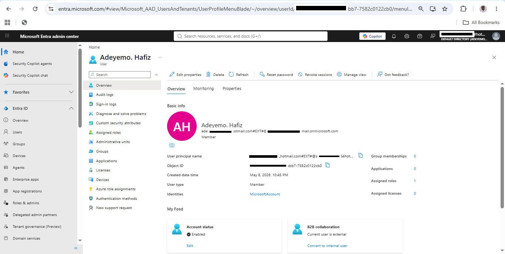<br>Shows the default Global Administrator account responsible for tenant-wide administration before delegating operational responsibilities to role-specific administrator accounts. |
| **03. Users Overview**<br><br>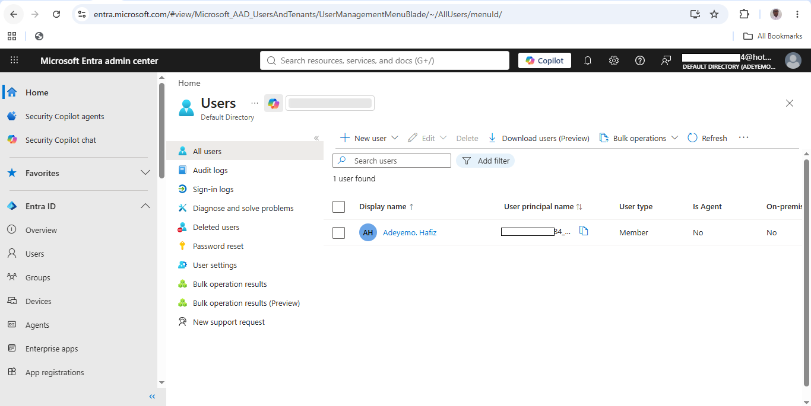<br>Displays the Microsoft Entra Users blade before provisioning additional enterprise administrator accounts. | **04. Create New User**<br><br>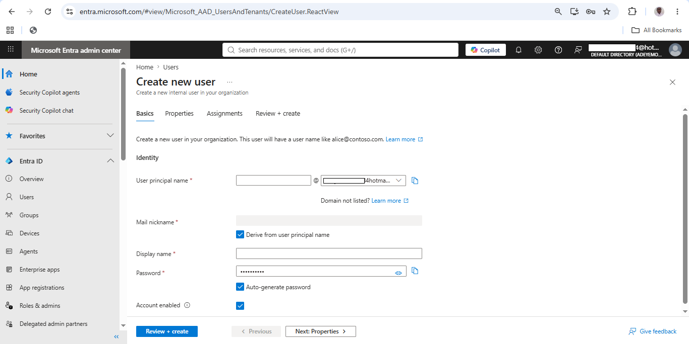<br>Demonstrates the creation of a cloud-only administrator account using standardized enterprise naming conventions. |
| **05. User Properties**<br><br>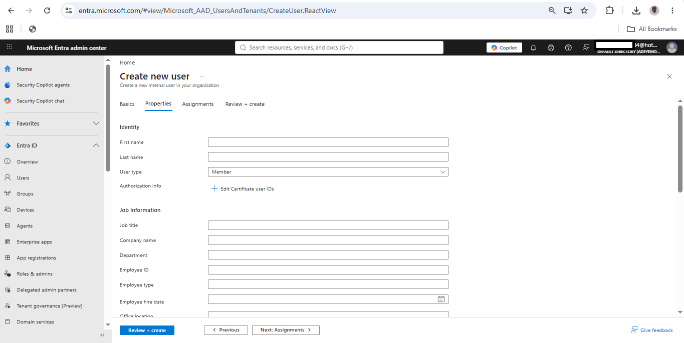<br>Shows administrative profile information including department, job title, employee ID, company name, and usage location. | **06. User Assignments**<br><br>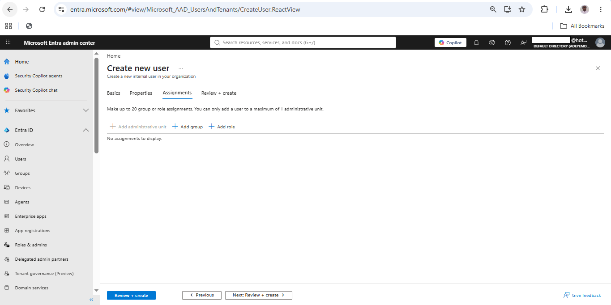<br>Displays group and role assignment options available during user provisioning. |
| **07. Review and Create User**<br><br>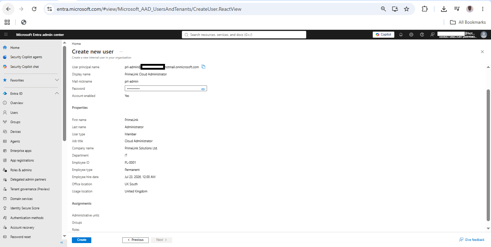<br>Verifies the user configuration before deployment into Microsoft Entra ID. | **08. Enterprise Users Created**<br><br>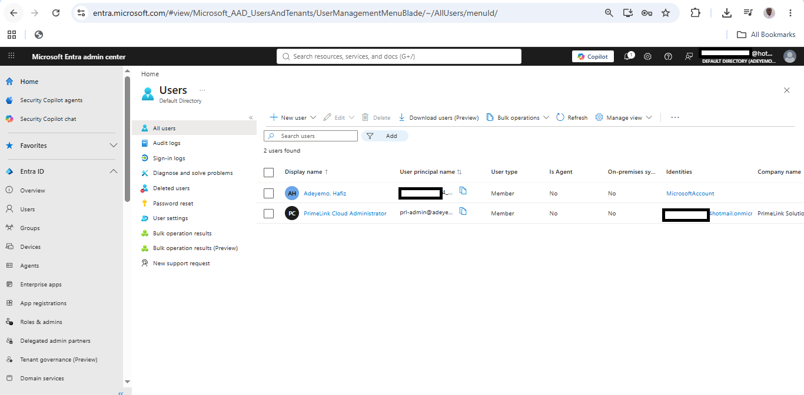<br>Shows all enterprise administrator accounts successfully provisioned within the tenant. |
| **09. PrimeLink Cloud Administrator Overview**<br><br>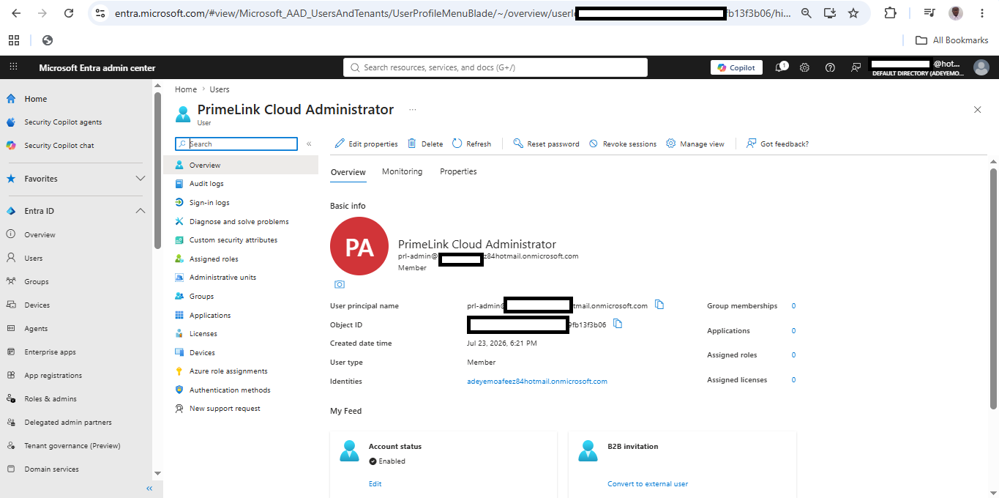<br>Displays the profile of the dedicated Cloud Administrator account created for operational administration. | **10. Enterprise Users**<br><br>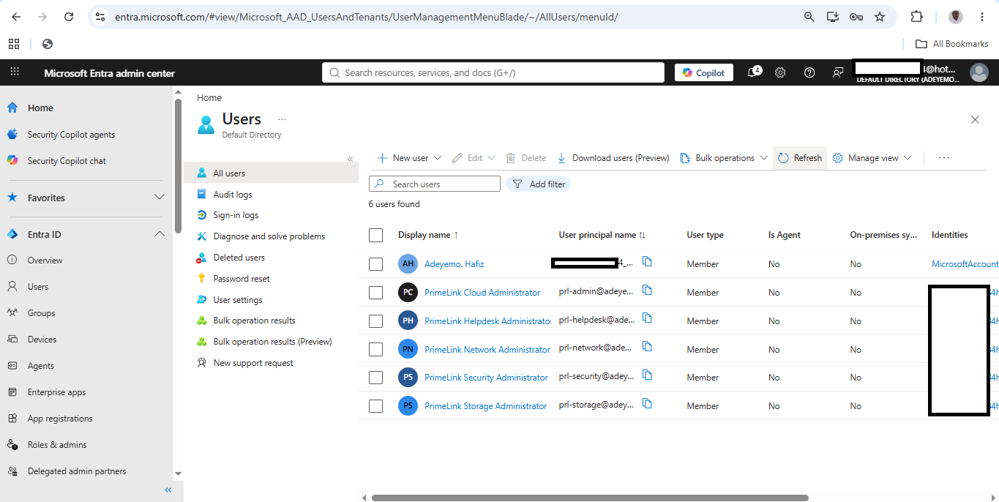<br>Shows the completed administrator team representing different operational departments. |
| **11. Create Security Group**<br><br>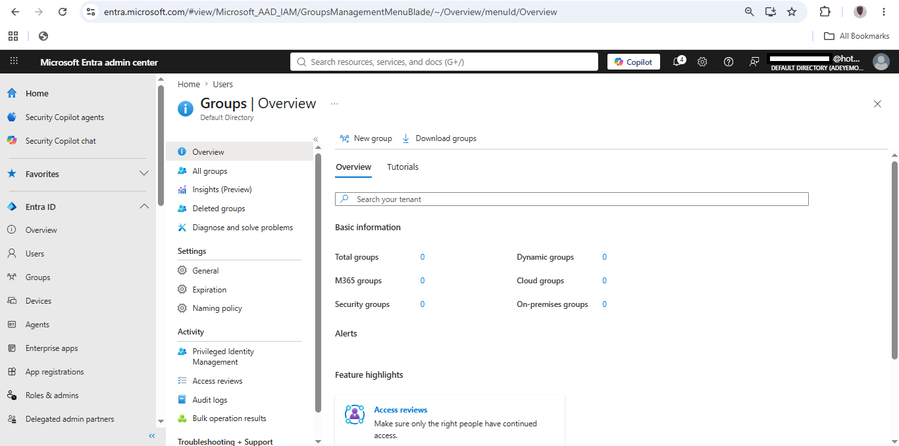<br>Demonstrates the creation of an enterprise Security Group using assigned membership. | **12. GG-IT-Admins Created**<br><br>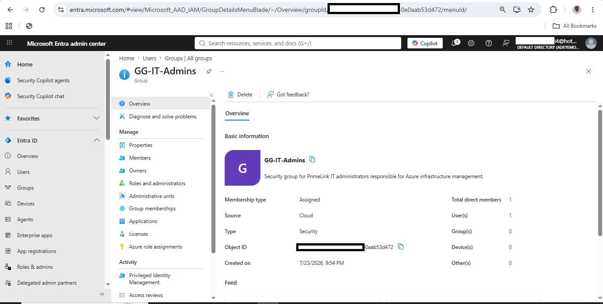<br>Shows the successful deployment of the primary IT administration Security Group. |
| **13. Enterprise Security Groups**<br><br>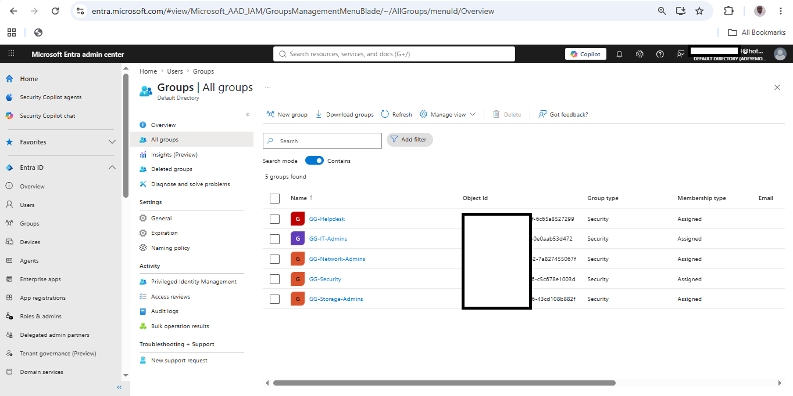<br>Displays all Security Groups created for enterprise identity management. | **14. Enterprise Security Groups Overview**<br><br>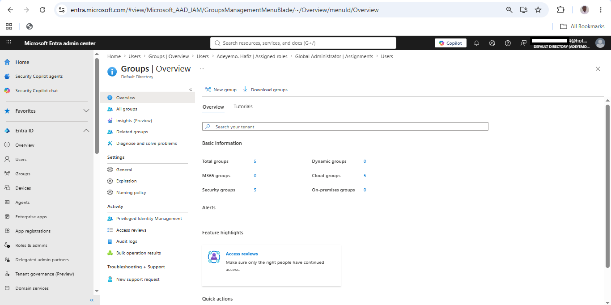<br>Provides an overview of the Microsoft Entra Security Group environment, including total groups and group types. |
| **15. GG-IT-Admins Membership**<br><br>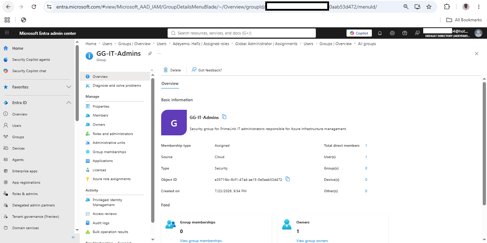<br>Verifies the assigned owner and member of the IT Administration Security Group. | **16. Resource Group IAM Overview**<br><br>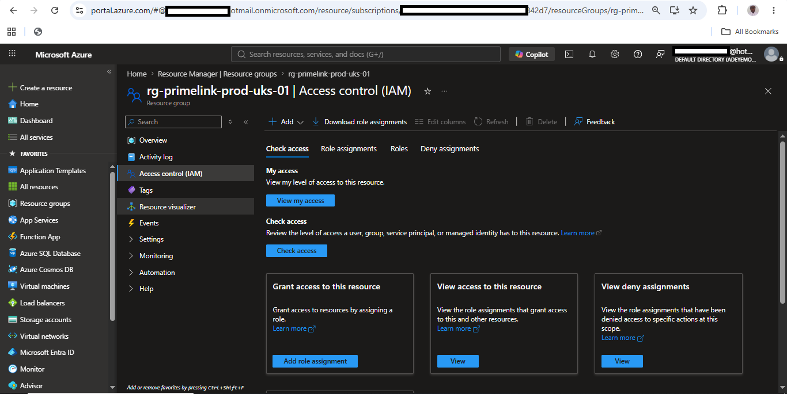<br>Shows Azure Access Control (IAM) for the production Resource Group before RBAC implementation. |
| **17. Add Role Assignment**<br><br>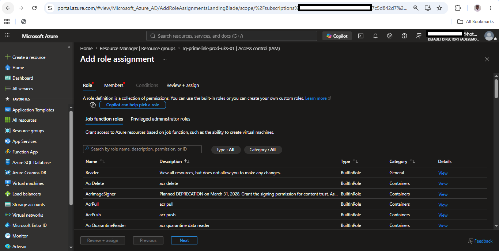<br>Demonstrates the Azure RBAC workflow used to assign permissions at the Resource Group scope. | **18. RBAC Member Selection**<br><br>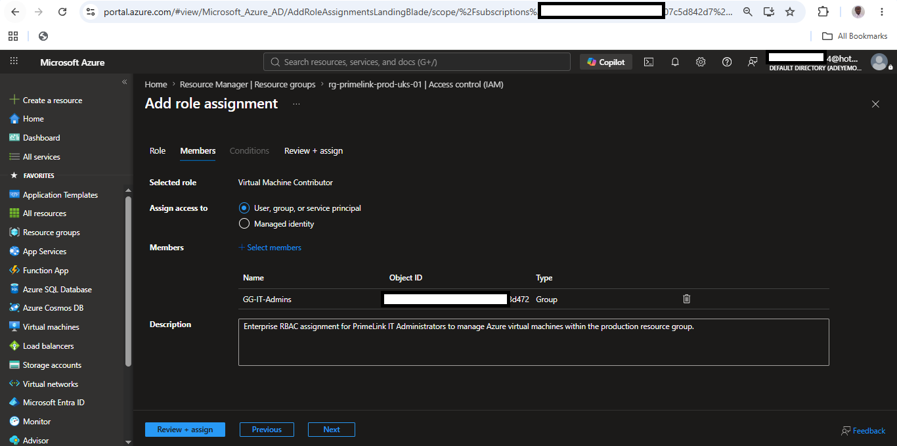<br>Shows the Security Group selected as the RBAC principal rather than assigning permissions directly to an individual user. |
| **19. Enterprise RBAC Role Assignments**<br><br>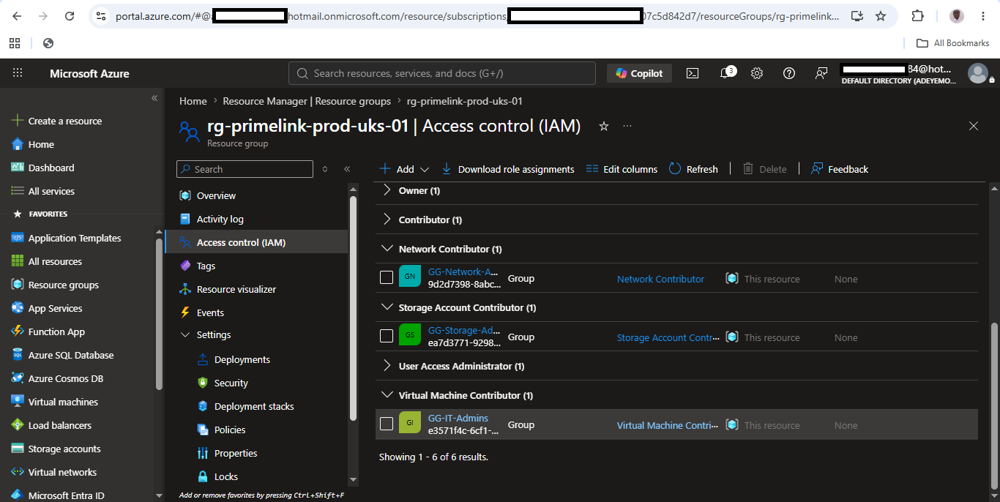<br>Displays the completed Azure RBAC configuration, including Virtual Machine Contributor, Network Contributor, and Storage Account Contributor assignments to their respective Security Groups. | |