# Project 06 – Enterprise Azure Storage Governance & Administration. 

---

---

## Project Information

| Property | Value |
|----------|-------|
| Project Number | 06 |
| Project Title | Enterprise Azure Storage Governance & Administration |
| Business Scenario | PrimeLink Ltd Enterprise Cloud Storage |
| Azure Service | Azure Storage |
| Difficulty | Intermediate |
| Environment | Microsoft Azure |
| Documentation Standard | Enterprise Implementation |

---

# 📋 Project Objective

Design and implement an enterprise storage solution for PrimeLink Ltd that demonstrates secure, scalable, and governed Azure Storage administration.

---

# Business Scenario

PrimeLink Ltd is migrating from traditional on-premises file servers to Microsoft Azure to improve scalability, security, and availability.

As the Azure Administrator, you have been tasked with deploying and managing Azure Storage services to provide secure document storage, departmental file sharing, application storage, and backup capabilities while following enterprise governance and least-privilege access principles.

---

# Business Requirements

The solution must:

- Centralize enterprise file storage.
- Support multiple departments.
- Secure access using Azure RBAC.
- Allow controlled external sharing.
- Support backup storage.
- Monitor storage health.
- Minimize storage costs.
- Follow enterprise naming standards.

---

# Architecture Overview

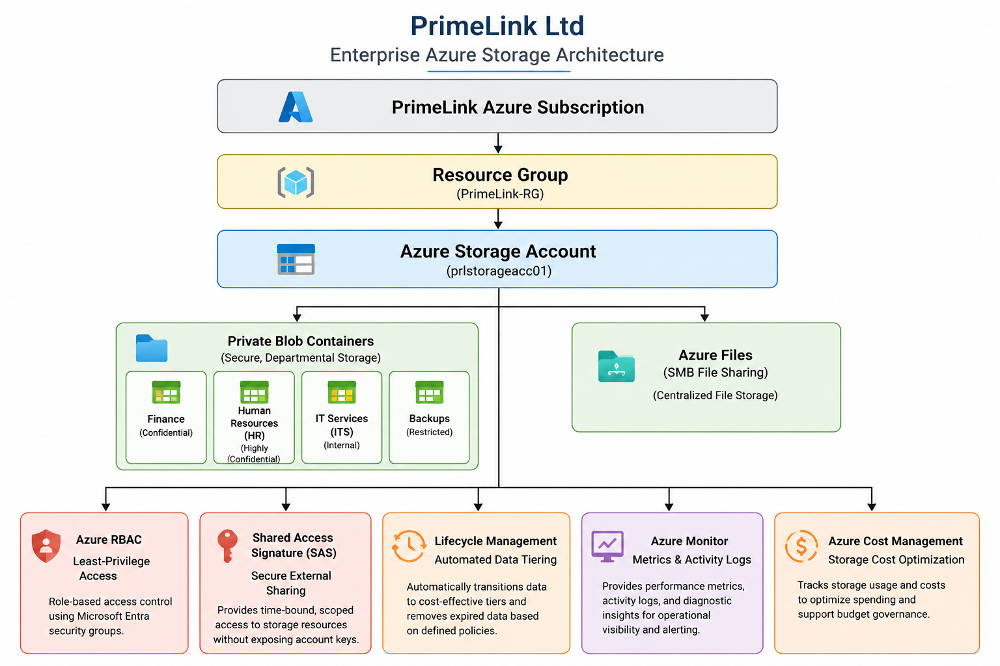

---

## Administrator Decision Matrix

| Decision | Selection | Business Justification |
|-----------|-----------|------------------------|
| Performance | Standard | Cost-effective for business workloads |
| Replication | LRS | Regional durability with lower cost |
| Access Tier | Hot | Frequently accessed departmental files |
| Encryption | Microsoft-managed keys | Reduced administrative overhead |
| Resource Group | Existing PrimeLink RG | Centralized governance |

---

### Security Considerations

- Secure transfer was enabled to enforce encrypted communication between clients and Azure Storage.
- Anonymous Blob access was disabled to prevent unauthorized public access to enterprise data.
- TLS 1.2 was selected to align with modern enterprise security standards.

### Storage Design Decisions
Standard Performance was selected because PrimeLink primarily stores business documents rather than latency-sensitive workloads.
Hot Access Tier was selected because departmental files are expected to be accessed regularly during business operations.
Microsoft-managed encryption keys were chosen to reduce operational complexity while maintaining encryption at rest.

### Governance Considerations

Enterprise resource tags were applied to support:

- Cost allocation
- Resource ownership
- Operational governance
- Inventory management
- Future automation

---

## Blob Storage Architecture

Separate Blob Containers were created for each business department instead of storing all files in a single container. This approach improves logical organization, simplifies permission management, supports future lifecycle policies, and aligns with enterprise data governance practices.

---

### Azure System Container ($logs) 

The **$logs** system container is automatically created when the legacy Azure Storage Analytics logging feature is enabled. It stores diagnostic log data generated by the Storage service and should not be modified or deleted manually.

> **Note:** Storage Analytics logging is considered a legacy monitoring solution. Microsoft now recommends sending storage diagnostics to an Azure Monitor Log Analytics Workspace through Diagnostic Settings to provide centralized logging, querying, alerting, and long-term monitoring for enterprise environments.

---

## Enterprise Data Organization

PrimeLink departmental data was organized into separate private Blob Containers based on business function. Sample business documents were uploaded to validate storage functionality and demonstrate real-world enterprise data organization. This structure improves operational management, access control, and future lifecycle policy implementation.

---

# Enterprise Data Classification

| Container | Purpose                                    | Data Classification |
| --------- | ------------------------------------------ | ------------------- |
| finance   | Financial reports and accounting documents | Confidential        |
| hrs       | Employee records and HR documents          | Highly Confidential |
| its       | Technical documentation and inventories    | Internal            |
| backups   | Business backup archives                   | Restricted          |

---

## Naming Convention 

 Azure Blob Container names must contain at least three characters. Therefore, abbreviated departmental names (hrs and its) were used while maintaining clear business meaning and compliance with Azure naming requirements.

---

## Storage Access Security Strategy

Instead of assigning general Contributor permissions, the Azure Administrator implemented the Storage Blob Data Contributor role to grant only the permissions required for managing blob data. This follows the Principle of Least Privilege by restricting administrative access to storage resources while reducing unnecessary privileges across the Azure environment.

---

# Enterprise RBAC & Least-Privilege Access

### Administrator Decision

The Storage Blob Data Contributor role was assigned to the GG-Storage-Admins Microsoft Entra security group instead of granting broader Contributor permissions. This approach follows the Principle of Least Privilege by allowing authorized administrators to manage blob data while preventing unnecessary management access to other Azure resources.

---

### Security Considerations

Azure RBAC assignments were implemented using Microsoft Entra security groups rather than assigning permissions directly to individual user accounts. This simplifies permission management, supports future user onboarding and offboarding, and aligns with enterprise identity governance best practices.

---

### Interview Readiness

**Question 1**

Why use a Security Group instead of assigning permissions directly to users?

**Answer:**

Security groups simplify administration by allowing permissions to be managed centrally. Users inherit permissions through group membership, reducing administrative overhead and improving consistency.

**Question 2**

Why assign Storage Blob Data Contributor instead of Contributor?

**Answer:**

Storage Blob Data Contributor grants access to blob data only, while Contributor manages Azure resources but doesn't automatically grant data access. Using the more specific role supports least-privilege security.

---

### Business Scenario

PrimeLink's Finance department needs to share a financial report with an external auditing company.

The external company should:

Read the file.
Download it.
Have access for only a limited time.
Not receive permanent access to the Storage Account.

The Azure Administrator decides to use a Shared Access Signature (SAS).

### Decision

A Shared Access Signature (SAS) was generated to provide secure, temporary access to a Finance department document without exposing the Storage Account or Blob Container to public access. Read-only permissions and HTTPS-only access were configured to support secure external collaboration while following the Principle of Least Privilege.

### SAS Security Considerations

The SAS token was configured with:

Read-only permissions.
HTTPS-only communication.
Limited expiration time.
No anonymous public access.

This minimizes the risk of unauthorized access while enabling secure sharing with external business partners.

### Interview Readiness 

**Question**

Why use SAS instead of making the Blob Container public?

**Answer:**

Public access exposes data to anyone with the URL and offers little con
trol. A Shared Access Signature (SAS) provides secure, time-limited access with specific permissions such as read-only access, reducing security risks while supporting external collaboration.

---

# Operational Business Impact

Instead of only describing what you configured, you'll explain how it benefits the organization.

For example, for the SAS implementation:

By implementing Shared Access Signatures instead of enabling public access, PrimeLink Ltd can securely share documents with external partners while reducing the organization's exposure to unauthorized access. This approach improves compliance, protects sensitive business information, and supports controlled collaboration with third parties.

---

## Storage Network Configuration 

### Business Scenario

PrimeLink Ltd currently allows public network access during the deployment and testing phase. As the Azure environment matures, the Azure Administrator reviews networking options and plans future restrictions to reduce the attack surface while maintaining business operations.

### Network Design Decision

The Storage Account currently allows public network access to support deployment, validation, and future administrative tasks during the implementation phase. The configuration will be reviewed and hardened in a future security-focused project using Storage Firewalls and Private Endpoints.

---

### Interview Readiness

**Question**

Why didn't you immediately disable public network access?

**Answer:**

During the implementation phase, controlled public access simplifies deployment, validation, and administration. In a production environment handling sensitive workloads, public access should be reviewed and, where appropriate, replaced with Storage Firewalls, selected networks, or Private Endpoints based on business and security requirements.

---

# Lifecycle Management 

### Business Scenario

PrimeLink stores monthly backup archives. After 90 days, older backups are rarely accessed. Instead of keeping all backup data in the Hot tier, the Azure Administrator creates a lifecycle policy to automatically optimize storage costs.

### Cost Optimization Strategy

A lifecycle management policy was created for backup data to automatically transition infrequently accessed files to lower-cost storage tiers while defining a long-term retention period. This reduces operational storage costs without requiring manual intervention.

### Interview Readiness

**Question**

Why apply lifecycle management only to the backups container?

**Answer:**

Backup files typically become less active over time, making them good candidates for automated tiering. Business documents in Finance, HRS, or ITS may require more frequent access, so applying the same policy to those containers could negatively affect performance or user experience.

---

# Monitoring & Diagnostics 

### Business Scenario

PrimeLink Ltd's IT Operations team wants visibility into the health and performance of the company's Storage Account. The Azure Administrator has been asked to review built-in monitoring capabilities and prepare the Storage Account for future operational monitoring and troubleshooting.

### Monitoring Strategy 

Azure Monitor provides centralized visibility into Storage Account performance and administrative operations. Metrics enable performance monitoring, while the Activity Log records management actions for operational auditing and troubleshooting.

### Interview Readiness

**Question**

What is the difference between Metrics and Activity Log?

**Answer:**

Metrics measure the operational performance of Azure resources, such as transaction counts, availability, and latency over time. The Activity Log records management operations performed on Azure resources, including creation, updates, and configuration changes.

---

## Diagnostic Settings

Diagnostic Settings were reviewed as part of the monitoring strategy. Because a centralized Log Analytics Workspace has not yet been implemented within the PrimeLink environment, diagnostic log collection was intentionally deferred to a future monitoring and observability project. This approach keeps the current implementation aligned with the project's scope while acknowledging enterprise monitoring best practices.

# Cost Analysis 

### Business Scenario

PrimeLink's IT Manager wants confirmation that the newly deployed Storage Account is operating within expected cost parameters and that no unexpected charges have been introduced during the implementation.

---

### Cost Management Strategy

The Storage Account was deployed using Standard Performance with Locally Redundant Storage (LRS), providing a cost-effective solution for general business workloads. Lifecycle Management was implemented to automatically transition aging backup data to lower-cost storage tiers, supporting long-term operational cost optimization.

---

### Interview Readiness

**Question**

Why did you choose Standard + LRS instead of Premium + GRS?

**Answer:**

PrimeLink's current workload consists primarily of business documents and backup data, which do not require premium latency or cross-region replication. Standard Performance with LRS provides an appropriate balance of durability, performance, and cost. If future business continuity requirements expand, redundancy can be reviewed and upgraded.

---

## Validation Summary 

### Validation Results

The Storage Account and associated services were successfully deployed and validated. Departmental Blob Containers, Azure File Shares, RBAC assignments, Shared Access Signatures, Lifecycle Management policies, and monitoring capabilities were implemented according to the project requirements. All validation checks completed successfully.

---

# Final Solution Review

## Administrator Reflection

This project strengthened my understanding of enterprise Azure Storage administration by moving beyond simple resource deployment into secure storage design, RBAC implementation, lifecycle management, monitoring, cost optimization, and governance. It reinforced the importance of designing Azure resources with both operational efficiency and business requirements in mind.

## Production Recommendations

If this environment were deployed in production, I would additionally consider:

- Azure Private Endpoints
- Storage Firewalls
- Microsoft Entra ID authentication for Azure Files
- Customer-Managed Keys (CMK)
- Log Analytics integration
- Immutable Blob Storage where required

---

# Future Enhancements

As the PrimeLink Azure environment evolves, the following enhancements would further improve security, governance, scalability, and operational maturity:

- Implement User Delegation SAS instead of Account SAS where Microsoft Entra authentication is available.
- Deploy Azure Private Endpoints to eliminate public network exposure.
- Configure Azure Storage Firewalls with selected network access.
- Integrate Diagnostic Settings with Azure Monitor Log Analytics Workspace.
- Enable Microsoft Defender for Storage for advanced threat detection.
- Implement Customer-Managed Keys (CMK) using Azure Key Vault.
- Configure Azure Backup for additional business continuity.
- Enable Blob Versioning and Soft Delete for improved data protection.
- Configure Immutable Blob Storage where regulatory compliance requires write-once-read-many (WORM) protection.
- Implement Azure Policy to enforce enterprise storage governance and compliance standards.

---

# Production Readiness Assessment

| Category | Status | Notes |
|----------|:------:|-------|
| Naming Standards | ✅ | Enterprise naming followed |
| Resource Tags | ✅ | Applied consistently |
| Secure Transfer | ✅ | Enabled |
| TLS 1.2 | ✅ | Enforced |
| Blob Containers | ✅ | Department-based organization |
| Azure File Share | ✅ | Operational |
| RBAC | ✅ | Least privilege implemented |
| Shared Access Signature | ✅ | Secure external sharing |
| Lifecycle Management | ✅ | Automated cost optimization |
| Monitoring | ✅ | Metrics and Activity Log reviewed |
| Diagnostic Strategy | ✅ | Ready for future Log Analytics integration |
| Cost Optimization | ✅ | Lifecycle policy implemented |

---

# Screenshot Gallery

> The following screenshots provide implementation evidence for each major stage of the Azure Storage deployment and demonstrate successful completion of the project's business requirements.

| Screenshot | Description |
|------------|-------------|
| 01 | Create Storage Account |
| 02 | Storage Account Overview |
| 03 | Blob Containers |
| 04 | Upload Business Files |
| 05 | Azure File Share |
| 06 | Storage RBAC Role Selection |
| 07 | Storage RBAC Assignment |
| 08 | Shared Access Signature (SAS) |
| 09 | Storage Network Configuration |
| 10 | Lifecycle Management |
| 11 | Storage Metrics |
| 12 | Activity Log |
| 13 | Diagnostic Settings |
| 14 | Cost Analysis |
| 15 | Storage Validation Dashboard |

---

# Implementation Evidence

The following implementation evidence demonstrates the successful deployment, configuration, security, governance, monitoring, and validation of the Azure Storage solution for PrimeLink Ltd. Each screenshot represents a completed implementation milestone and supports the project's business and technical objectives.

<b>Phase 1: Core Storage Provisioning (Steps 01–05)</b>

 

## 01. Create Storage Account

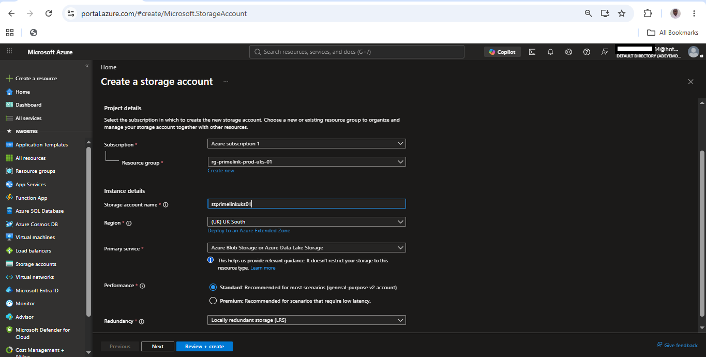

**Configured** an enterprise Azure Storage Account using the PrimeLink production Resource Group, Standard performance, and Locally Redundant Storage (LRS), establishing a secure and cost-effective storage foundation aligned with the project's business and governance requirements.

---

## 02. Storage Account Overview

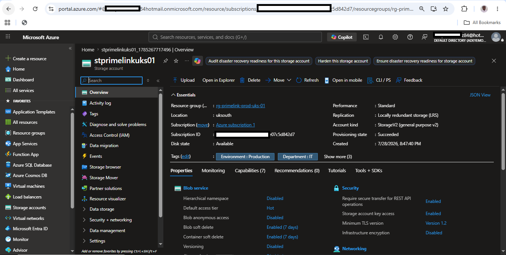

**Verified** the successful deployment of the Azure Storage Account by reviewing its configuration, operational status, replication settings, performance tier, and security properties within the PrimeLink production environment.

---

## 03. Blob Containers

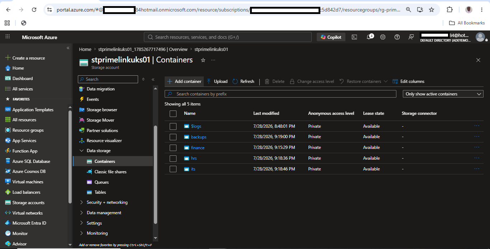

**Created** dedicated private Blob Containers for Finance, Human Resources, IT Services, and Backup workloads, providing logical separation of business data while supporting enterprise governance, access control, and future lifecycle management.

---

## 04. Upload Business Files

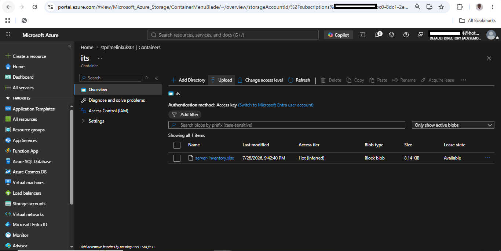

**Validated** Blob Storage functionality by uploading representative departmental business documents, confirming successful data storage while demonstrating a practical enterprise data organization strategy.

---

## 05. Azure File Share

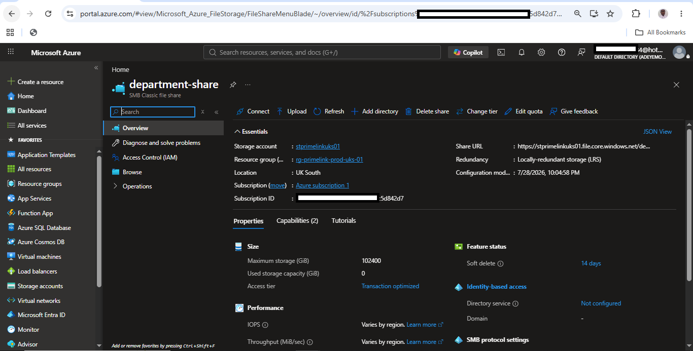

**Provisioned** an Azure File Share to provide centralized SMB-compatible storage for departmental file sharing, supporting future integration with Windows-based systems and enterprise collaboration.

<b>Phase 2: Security & Access Control (Steps 06–09)</b>

 

## 06. Storage RBAC Role Selection

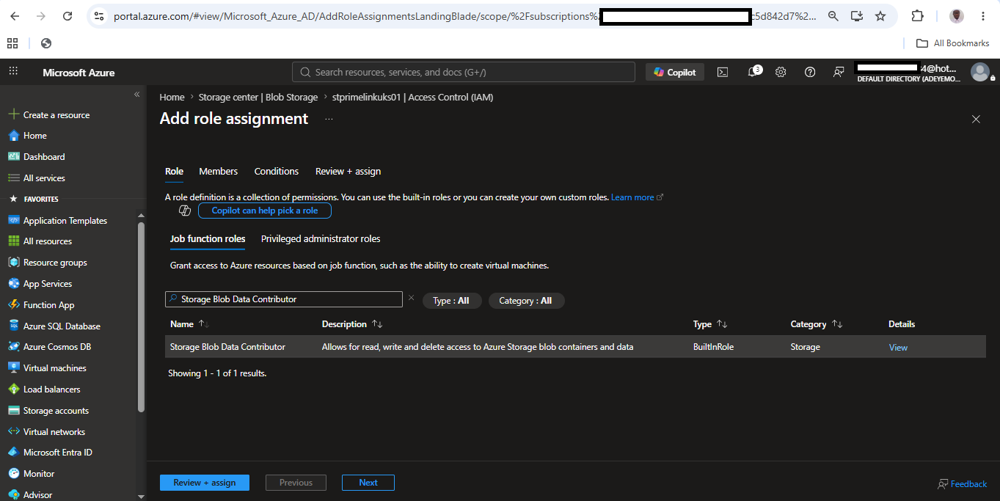

**Selected** the Storage Blob Data Contributor role to implement role-based access control using the Principle of Least Privilege, ensuring administrators receive only the permissions necessary to manage Blob data.

---

## 07. Storage RBAC Assignment

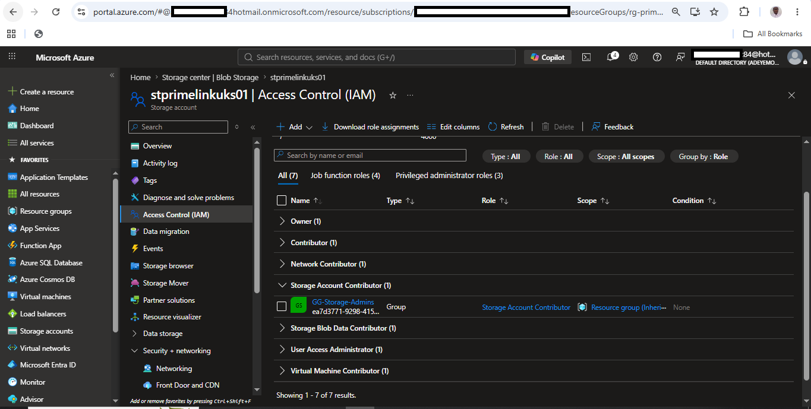

**Assigned** the Storage Blob Data Contributor role to the **GG-Storage-Admins** Microsoft Entra security group, demonstrating enterprise identity management through centralized group-based access control instead of direct user assignments.

---

## 08. Shared Access Signature (SAS)

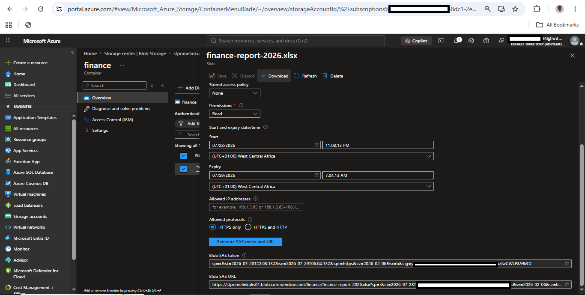

**Generated** a Shared Access Signature (SAS) with read-only permissions, HTTPS enforcement, and a limited expiration period to enable secure external file sharing without exposing the Storage Account or Blob Containers to public access.

---

## 09. Storage Network Configuration

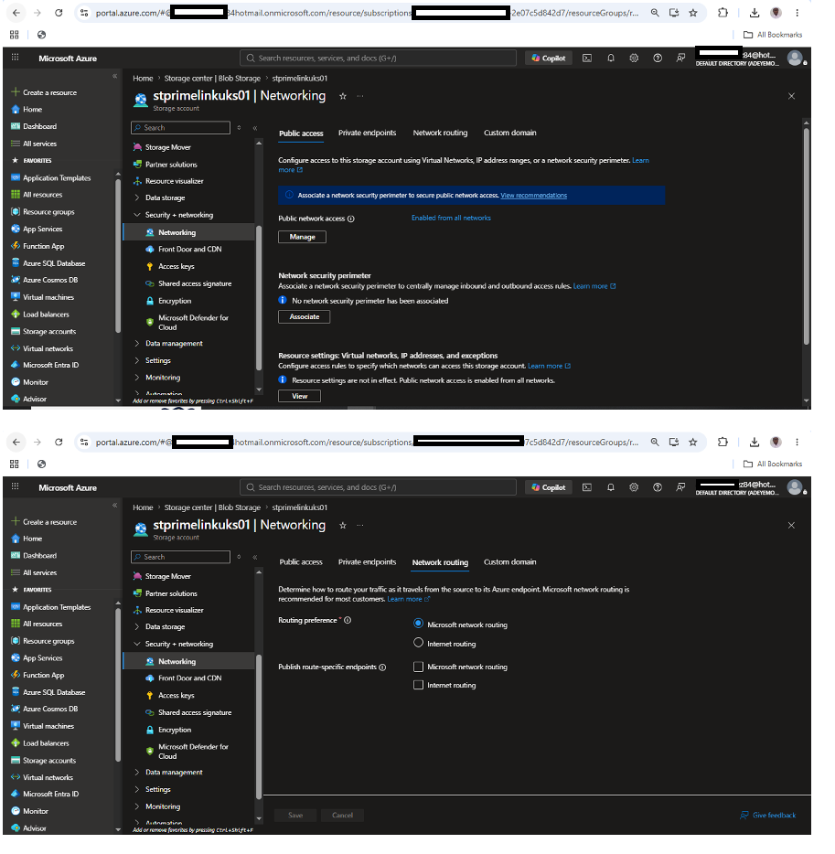

**Reviewed** the Storage Account network configuration to validate secure connectivity settings while documenting the planned transition from public network access to more restrictive network controls in future security-focused implementations.

<b>Phase 3: Lifecycle Management & Cost Optimization (Steps 10 & 14)</b>

 

## 10. Lifecycle Management

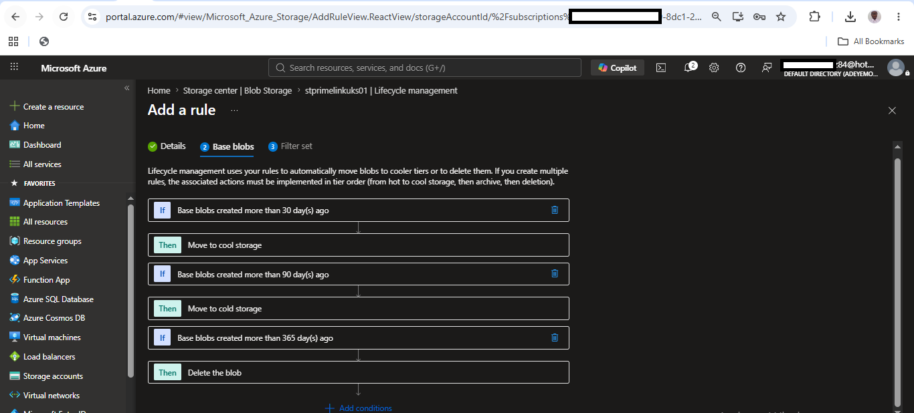

**Implemented** an automated lifecycle management policy to transition backup data to lower-cost storage tiers and remove expired data according to defined retention policies, supporting long-term governance and storage cost optimization.

---

## 14. Storage Cost Analysis

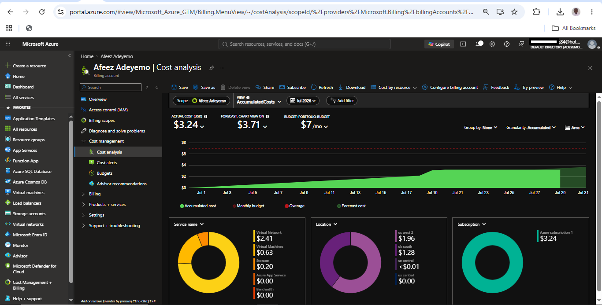

**Analyzed** Azure Cost Management to verify that the Storage Account deployment aligns with the project's cost optimization objectives while confirming the effectiveness of the selected storage performance, redundancy, and lifecycle management strategies.

<b>Phase 4: Monitoring & Validation (Steps 11–13, 15)</b>

 

## 11. Storage Metrics

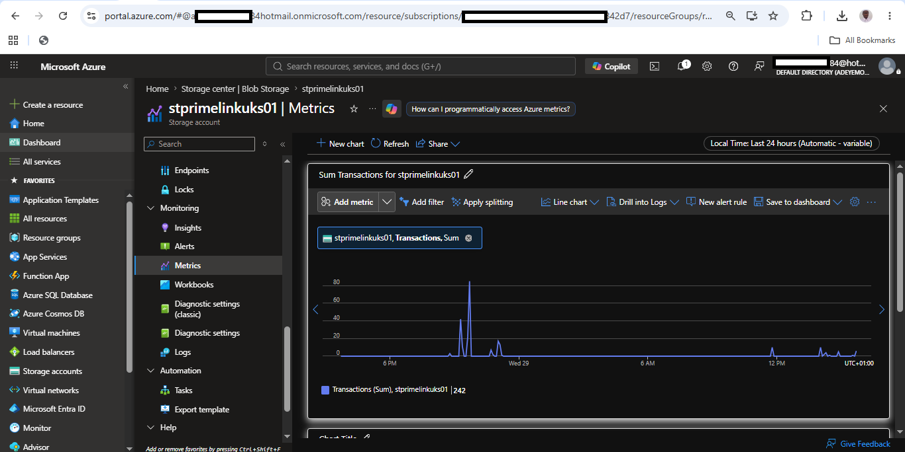

**Confirmed** that Azure Monitor Metrics were available for the Storage Account, demonstrating readiness for ongoing performance monitoring, capacity planning, and operational visibility as business workloads increase.

---

## 12. Storage Activity Log

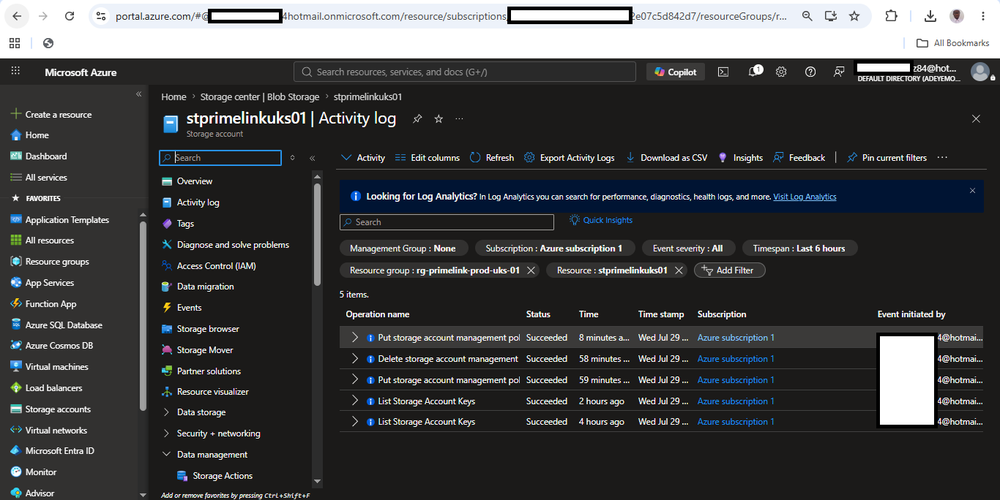

**Reviewed** the Azure Activity Log to verify management operations performed during the implementation, providing an auditable record of administrative actions for operational governance and troubleshooting.

---

## 13. Diagnostic Settings

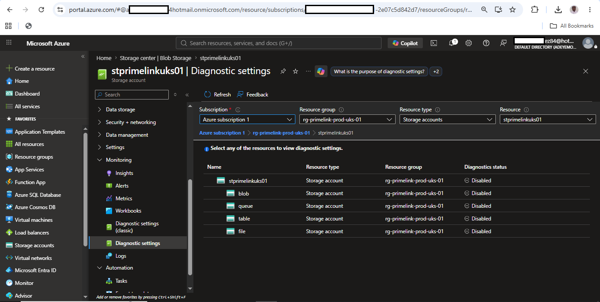

**Evaluated** the Diagnostic Settings configuration as part of the overall monitoring strategy, documenting the decision to defer centralized log collection until a Log Analytics Workspace is implemented in a future observability project.

---

## 15. Storage Validation Dashboard

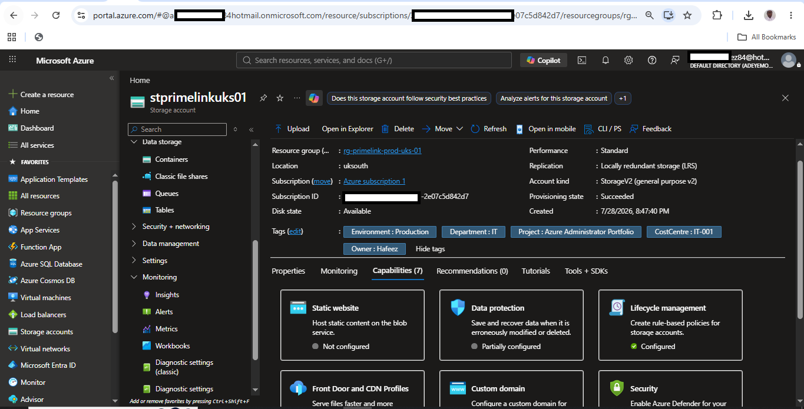

**Validated** the completed Azure Storage implementation by confirming that storage services, security controls, RBAC assignments, monitoring capabilities, lifecycle policies, and governance configurations satisfied the project's business and technical requirements.

# Project Conclusion

This project demonstrated the end-to-end deployment, configuration, governance, monitoring, and validation of an enterprise Azure Storage solution for PrimeLink Ltd. The implementation combined secure storage design, role-based access control, lifecycle management, monitoring, and cost optimization while following Microsoft Azure administration best practices.

The completed solution establishes a scalable foundation that can be further enhanced with Private Endpoints, Log Analytics, Microsoft Defender for Storage, Customer-Managed Keys, and enterprise backup strategies as future projects expand the environment.
